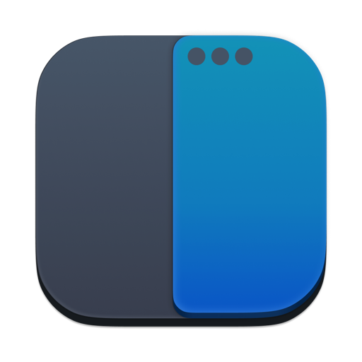
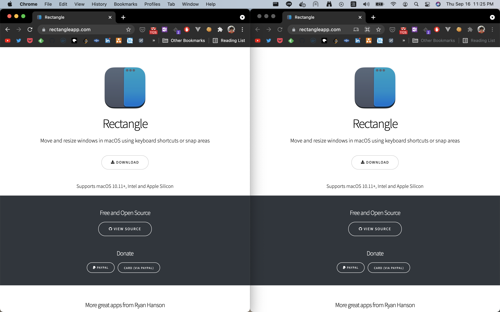
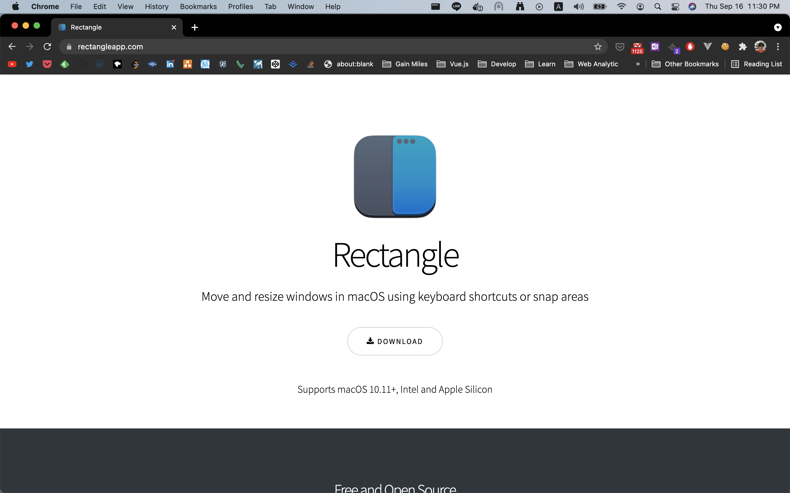
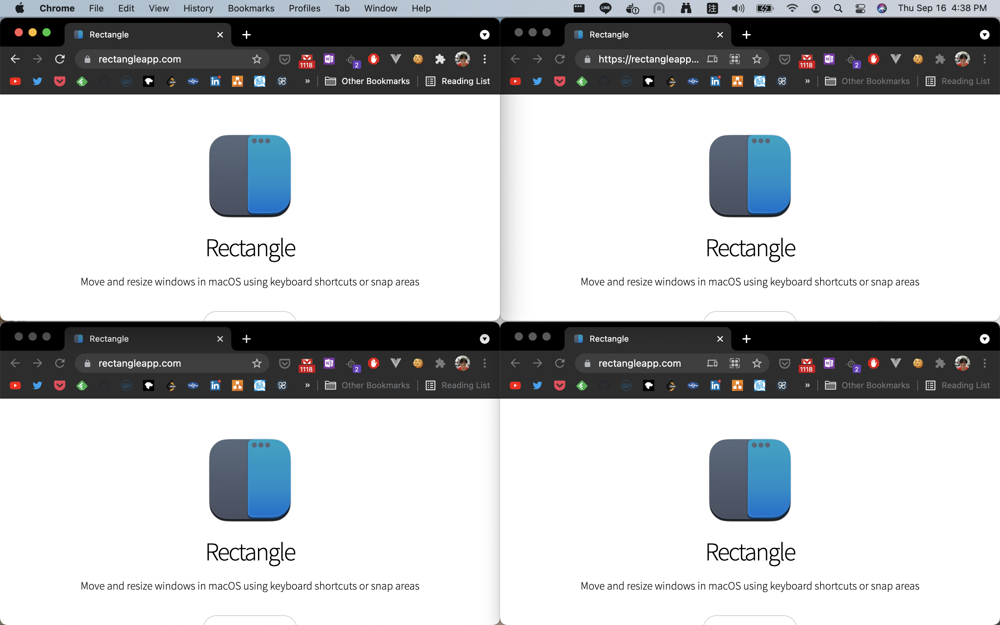
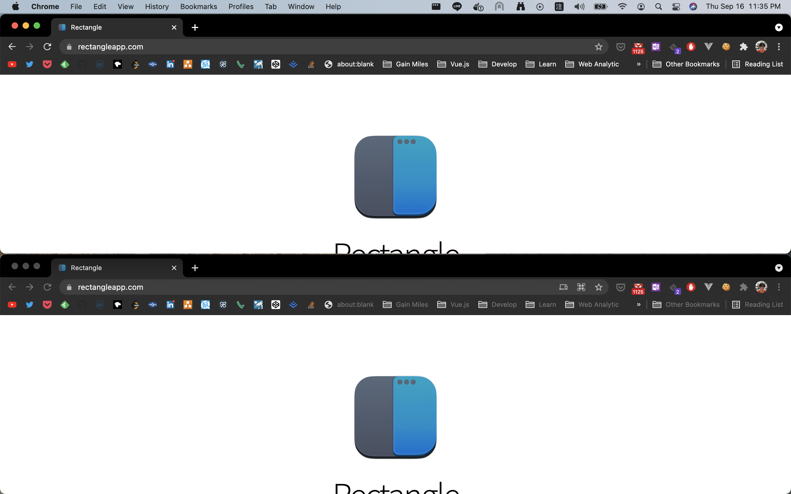
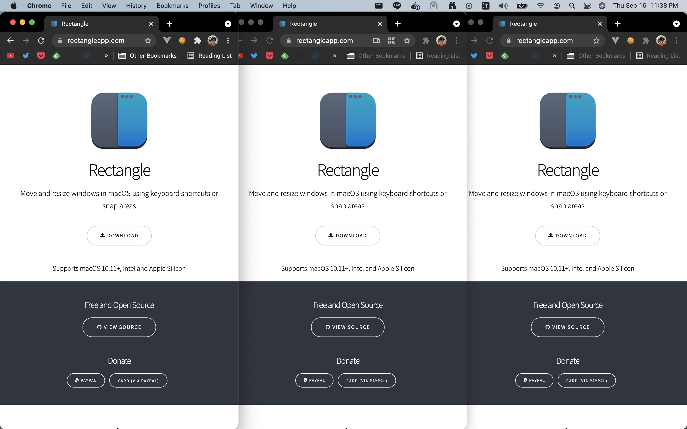
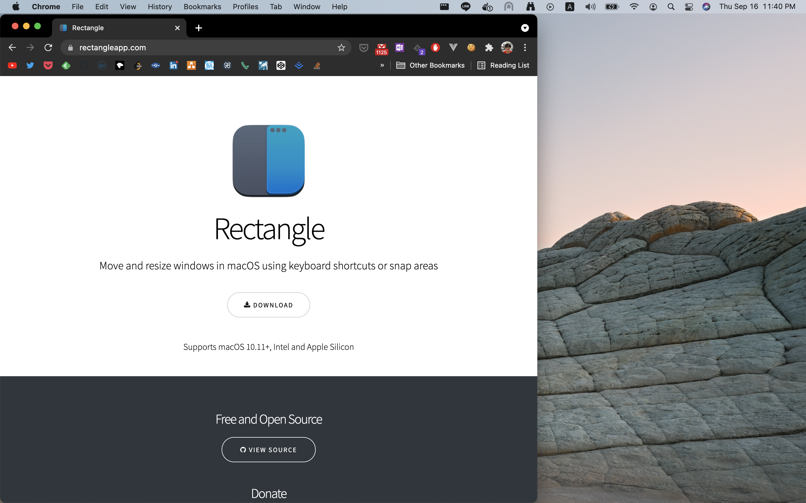
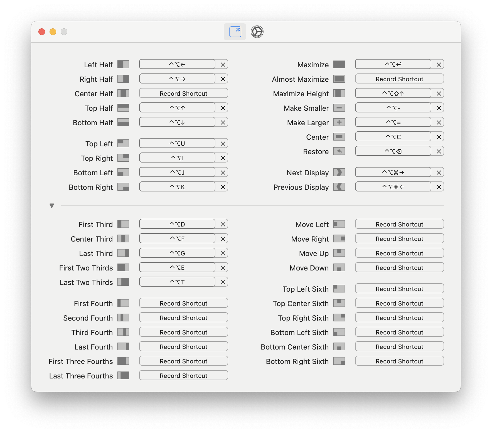
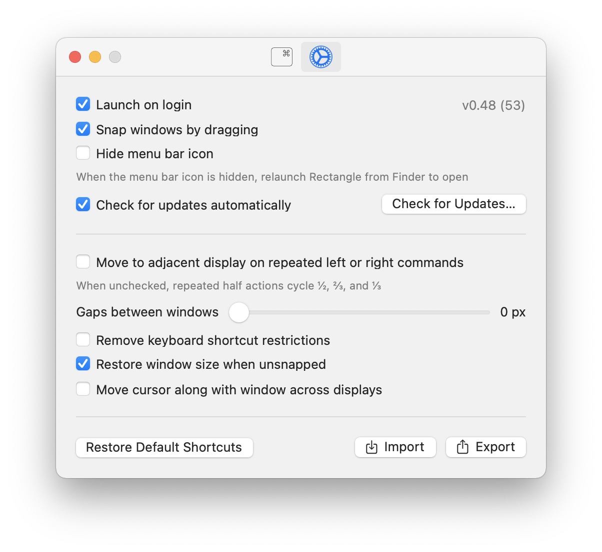

# 02 - Rectangle - 視窗管理工具

macOS 原生並不支援視窗的分割顯示，可以達到差不多效果的只有在「空間」中指定左右兩邊顯示的視窗而已，如果要預覽視窗而不希望重疊，不是需要在建立新的「空間」，就是要打開「控制中心」，要不然就只能自己用鼠標移到期望的位置了。

為了在開發時，在同個螢幕上取得多個視窗的資訊，我們需要藉由視窗管理工具的幫忙。

## macOS 的視窗管理工具 Rectangle



Rectangle 是個 macOS 的應用程式，它可以讓使用者利用鼠標或是快捷鍵將螢幕等分區隔，並在不同的區域中放入不同的視窗。

## 安裝 Rectanlgle

使用 Homebrew 安裝 Rectangle ：

```shell
brew install rectangle
```

接著在「啟動台」內按下 Rectangle 啟動應用程式。

## 使用鼠標配置視窗

Rectangle 可以藉由鼠標在拖拉視窗時所頂到的螢幕邊緣來決定配置視窗的方式。

### 左右邊緣的中間

將鼠標拉著視窗移至螢幕的左右邊緣的中間區段，會將視窗設置為螢幕一半的大小，並依照觸及的左右邊緣放置於對應的位置。



### 上方邊緣

將鼠標拉著視窗移至螢幕的上方邊緣，會將視窗設置為最大。



### 四個角落

將鼠標拉著視窗移至螢幕的四個角落，會變為螢幕的四分之一大小，並依照角落的位置，擺置於四個等分區塊中。



### 左右邊緣的上下區段

將鼠標拉著視窗移至螢幕的左右邊緣的上下區段，會將視窗設置為螢幕一半的大小，並依照觸及的上下區段放置於對應的位置。



### 下方邊緣的左中右區段

將鼠標拉著視窗移至螢幕的下方邊緣的左中右區段，會將視窗設置為螢幕三分之一的大小，並依照觸及的左中右區段放置於對應的位置。



### 下方邊緣的左右區段並拖至中間區段

將鼠標拉著視窗移至螢幕的下方邊緣的左右區段並繼續拖著視窗至中間區段，會將視窗設置為螢幕三分之二的大小，並依照觸及的左右區段放置於對應的位置。



## 使用快捷鍵控制視窗配置

除了使用鼠標， Rectangle 也提供了豐富的快捷鍵供使用者使用：



這裡介紹幾個常用的快捷鍵。

| 快捷鍵                                        | 動作                            |
| --------------------------------------------- | ------------------------------- |
| Control + Option + Return                     | 最大化                          |
| Control + Option + Up/Down/Left/Right Arrow   | 二分之一                        |
| Control + Option + U/I/J/L                    | 四分之一                        |
| Control + Option + C                          | 置中                            |
| Control + Option + Command + left/right arrow | 移至上/下個螢幕（僅限多螢幕時） |

## 使用視窗設定 Rectangle

於「啟動台」中點擊 Rectangle 的圖示，會顯示 Rectangle 的設定視窗，在視窗內可以進行相關的設定。



有快捷鍵與程式設定兩個分頁，依照自己的需求做設定。如果有多台機器需要同樣的設定時，也可以使用 Export 的功能輸出配置，將配置以 Import 匯入其他電腦中就可以完成配置。

## 使用指令設定 Rectangle

除了視窗上的設定選項外， Rectangle 提供使用者利用指令進行更細部的設定。

```shell
# 啟用 Todo 模式
defaults write com.knollsoft.Rectangle todo -int 1
```

使用 `defaults write` 指令，對 Rectangle （識別名為 `com.knollsoft.Rectangle` ）的特定參數進行調整。

配置參數以及其效果可以參考 [Rectangle 的 GitHub 說明](https://github.com/rxhanson/Rectangle#terminal-commands)。

## 本文重點整理

- 作業系統上的視窗應該藉由管理工具簡潔地配置於螢幕的各個區塊，以方便瀏覽。
- Rectangle 是個 macOS 的視窗管理工具，它可以透過鼠標或快捷鍵快速地分配視窗所在的區塊及大小。
- Rectangle 藉由鼠標拖拉視窗時所碰觸的螢幕邊緣位置來配置區塊及大小。
- Rectangle 的常用快捷鍵：
  - Control + Option + Return ：最大化
  - Control + Option + Up/Down/Left/Right arrow ：二分之一
  - Control + Option + U/I/J/L ：四分之一
  - Control + Option + C ：置中
  - Control + Option + Command + left/right arrow ：移至上/下個螢幕（僅限多螢幕時）
- Rectangle 的配置可以藉由視窗選項或是指令來設定。
- 使用指令設定 Rectangle 時，其識別碼為 `com.knollsoft.Rectangle` 。

## 參考資料

- [Rectangle](https://rectangleapp.com/)
- [GitHub ： rxhanson/Rectangle](https://github.com/rxhanson/Rectangle)
