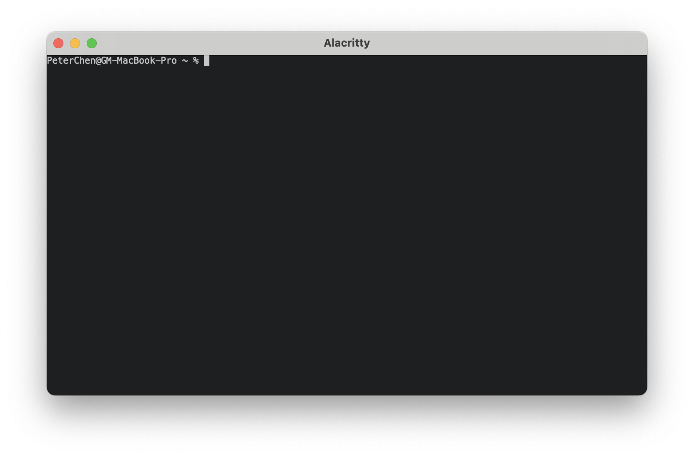
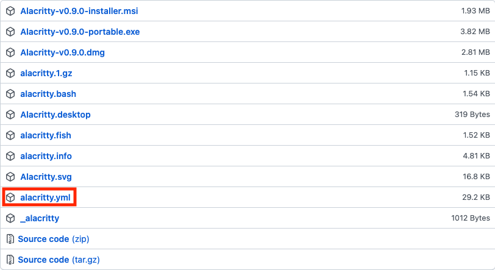
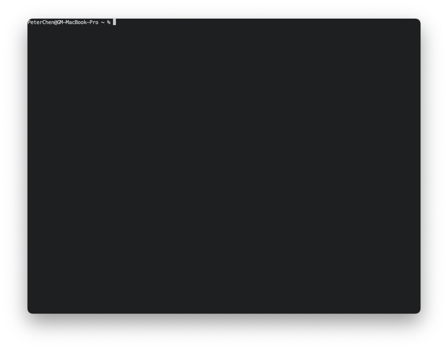

# 03 - Alacritty - 終端機

macOS 的預設終端機為 Terminal.app ，對於使用終端頻率較少的一般使用者是十分足夠的，但對於開發者而言，它依然有許多可以改進的地方，像是執行效率、配置方式等。

為了提升開發時使用終端機時的效率，因此我們需要一個適合開發的終端。

## 高效的終端機 Alacritty


Alacritty 是個執行速度極快的跨平台終端機，它專注在終端機本身的功能上，因此像是許多終端機都內置的分頁功能， Alacritty 是沒有的，取而代之的是建議使用者整合其他專注特定功能的工具來使用（例如分頁與視窗功能可以藉由整合 Tmux 達成）。

因為其實作的功能單純，因此使得它擁有高效率與高擴展的特性，成為合適開發者使用的終端機之一。

## 安裝 Alacritty

使用 Homebrew 安裝 Alacritty ：

```shell
brew install alacritty
```

接著在「啟動台」內按下 Alacritty 啟動應用程式。



## 配置 Alacritty

Alacritty 的配置依賴一個 Yaml 檔，預設並不會產生這個配置檔，需要自行去下載。

在 [GitHub 的發布頁](https://github.com/alacritty/alacritty/releases)中可以找到名為 `alacritty.yml` 的檔案，這就是 Alacritty 配置檔的內容。請依照安裝的版本，下載對應的檔案。



這個配置檔可以放於：

1. `$XDG_CONFIG_HOME/alacritty/alacritty.yml`
2. `$XDG_CONFIG_HOME/alacritty.yml`
3. `$HOME/.config/alacritty/alacritty.yml`
4. `$HOME/.alacritty.yml`

Alacritty 會依序由第一個往下找各個路徑，如果都沒有設置，則會使用預設的配置。

在放置好後，打開配置檔，會看到有各個設定屬性及說明，全部的屬性都會是註解的狀態，如果要做設定，請將屬性反註解，部分屬性需重啟 Alacritty 才會顯現效果，說明上會有提示，可以依照說明來決定是否重啟。

舉個例子，如果我現在想要把上方列給除去的話，我可以將 `window.decorations` 值改為 `buttonless` ：

```yaml
window:
  # Window dimensions (changes require restart)
  #
  # Window decorations
  #
  # Values for `decorations`:
  #     - full: Borders and title bar
  #     - none: Neither borders nor title bar
  #
  # Values for `decorations` (macOS only):
  #     - transparent: Title bar, transparent background and title bar buttons
  #     - buttonless: Title bar, transparent background and no title bar buttons
  decorations: buttonless
```

依照指示 `window` 相關的屬性變更都需要重啟 Alacritty ，重啟後就可以看到配置生效後的效果了。



接著介紹幾個常用的配置。

## 視窗配置

```yaml
window:
  # 動態調整邊緣與內容的間距，避免切到內容
  dynamic_padding: true

  # 隱藏視窗上方的 Bar
  decorations: buttonless

  # 開啟時的初始模式
  startup_mode: Maximized
```

## 字型配置

```yaml
font:
  normal:
    family: Hack Nerd Font Mono
    style: Regular
  bold:
    family: Hack Nerd Font Mono
    style: Bold
  italic:
    family: Hack Nerd Font Mono
    style: Italic
  bold_italic:
    family: Hack Nerd Font Mono
    style: Bold Italic

  # 字元大小
  size: 16.0

  offset:
    x: 0
    # 行間距
    y: 8

  glyph_offset:
    x: 0
    # 保持 offset 的一半，確保字元會在行的正中間
    y: 4

  use_thin_strokes: true
```

> 字型來源是 [NERD FONTS](https://www.nerdfonts.com/) ，可以使用 [Homebrew 安裝](https://github.com/ryanoasis/nerd-fonts#option-4-homebrew-fonts)

## 顏色主題

```yaml
# Colors (One Dark)
colors:
  # Default colors
  primary:
    background: '0x1e2127'
    foreground: '0xabb2bf'

  # Normal colors
  normal:
    black: '0x1e2127'
    red: '0xe06c75'
    green: '0x98c379'
    yellow: '0xd19a66'
    blue: '0x61afef'
    magenta: '0xc678dd'
    cyan: '0x56b6c2'
    white: '0xabb2bf'

  # Bright colors
  bright:
    black: '0x5c6370'
    red: '0xe06c75'
    green: '0x98c379'
    yellow: '0xd19a66'
    blue: '0x61afef'
    magenta: '0xc678dd'
    cyan: '0x56b6c2'
    white: '0xffffff'
```

> 顏色主題參考 [eendroroy/alacritty-theme](https://github.com/eendroroy/alacritty-theme) 的 One Dark 。

## 啟動時自動執行指令

在啟動終端機時，如果有想要自動執行的指令，可以使用 `shell` 屬性來設置。

```yaml
# 啟動時執行的指令
shell:
  program: /bin/zsh
  args:
    - -l
    - -c
    - 'tmux attach || tmux'
```

上面的設定會在啟動 Alacritty 時自動執行 Tmux 。

> 完整的配置可以參考 [peterhpchen/dotfiles](https://github.com/peterhpchen/dotfiles/blob/c185e895a94e4ac1445e9389e206134038019bd7/alacritty/alacritty.yml) 。

## 本文重點整理

- macOS 預設的終端機 Terminal.app 於效能較差，配置不便利。
- Alacritty 是個跨平台的終端機。
- Alacritty 專注於終端機本身的功能優化與改良，額外功能需仰賴其他工具。
- Alacritty 的配置為單個配置檔 `alacritty.yml` 。
- 在 GitHub 的發布頁中可以找到對應版本的配置檔內容，包含屬性及說明。
- 可以利用不同的屬性配置來客製**視窗**、**字型**、**顏色主題**與**執行指令**等。

## 參考資料

- [GitHub ： alacritty/alacritty](https://github.com/alacritty/alacritty)
- [Rahul Gupta ： How I migrated from iTerm to alacritty](https://pezcoder.medium.com/how-i-migrated-from-iterm-to-alacritty-c50a04705f95)
- [GitHub ： tmcdonell/config-alacritty](https://github.com/tmcdonell/config-alacritty)
- [GitHub ： PezCoder/dotfiles](https://github.com/PezCoder/dotfiles)
