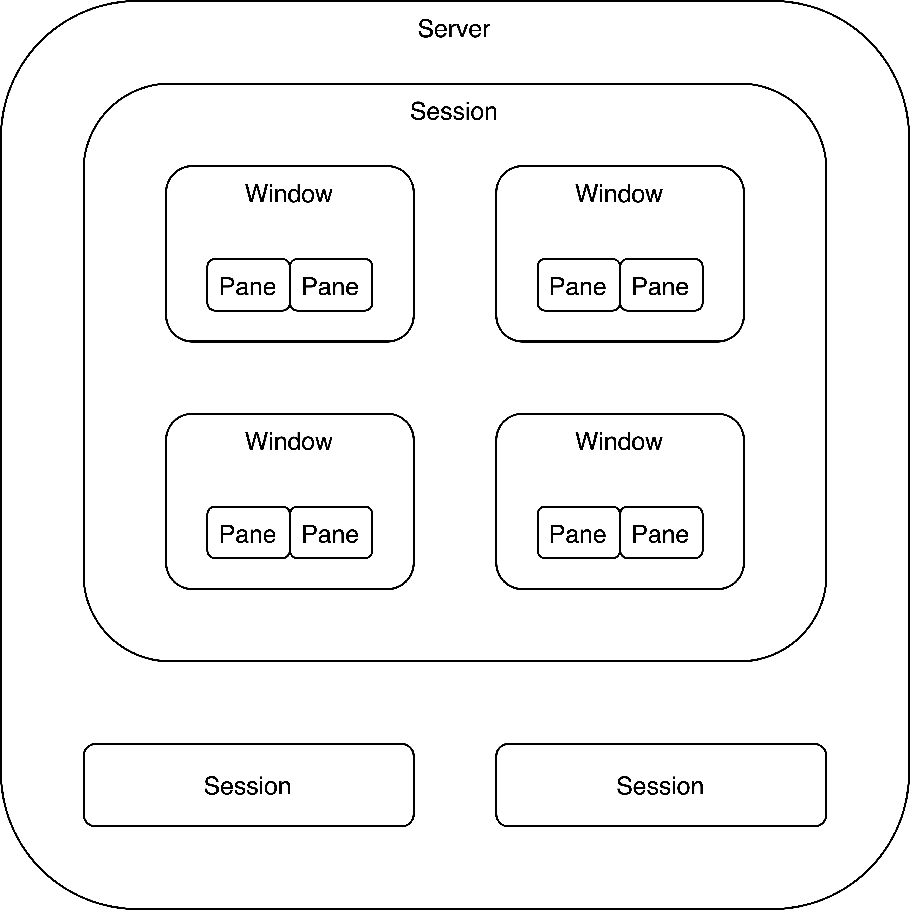
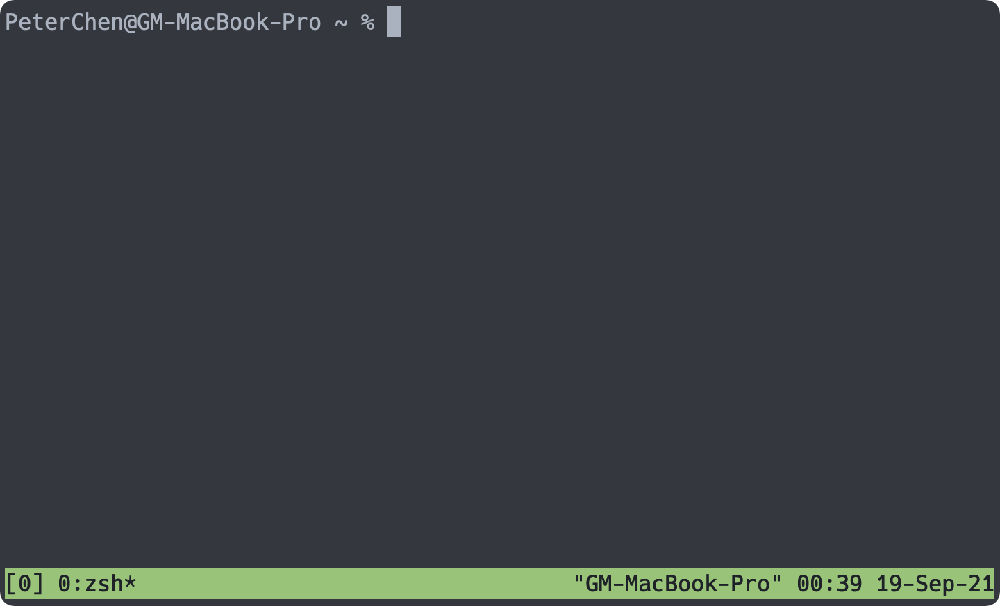
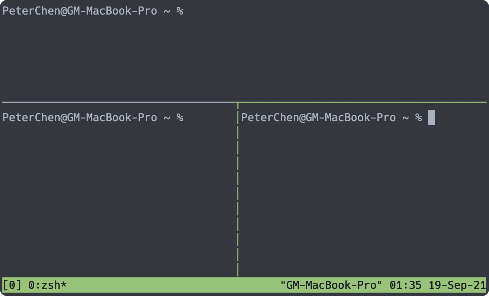
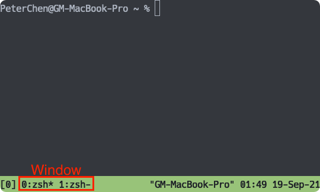

# 04 - Tmux - 終端機管理工具

在開發時，常常需要多個指令同時運作（例如一個啟動前端專案、一個啟動後端專案），因此會需要同時開啟多個終端執行指令，並觀察各個指令的運作情形。而在多個終端機同時開啟的情況下，開發者是很難有效地管理各個終端機視窗，在難以控管的狀態下，開發的效率就會因此大打折扣。

而終端的當前狀態的保存也是一大問題，在關閉終端機的程序，並重新啟動終端機後，會發現之前的狀態已經不存在了，原本在終端機中執行的指令，也會因為終端機的關閉而停止，使得開發陷入麻煩。

這時，使用終端機的管理工具 Tmux 就可以解決上述的問題。

## 終端的多工工具 Tmux


Tmux 是個終端機的管理工具，它讓使用者可以在單一個終端機應用程式中操作多個終端，並且會紀錄每個終端的狀態，就算是關閉了終端機應用程式，只要 Tmux 應用依然在運作，就可以隨時地重新叫出保存著狀態的終端機。

## 概念說明

在啟動 Tmux 時，它會啟動一個 **Server** ，這個 Server 可以包含多個 **Session** ，每個 Session 可以控管多個 **Window** ，而一個 Window 內可以有多個 **Pane** 。



- Server ： Server 用來管理 Session ，只要 Server 沒有被關閉，所有終端的狀態就不會丟失。
- Session ： Session 由 Window 組成，它可以包含多個 Window ，是 Tmux 控管的最大單位。
- Window ： Window 由 Pane 組成，它可以包含多個 Pane ，是視窗中單一可視的最大單位。
- Pane ： 每個 Pane 都是個終端。

## 安裝 Tmux

使用 Homebrew 安裝 Tmux ：

```shell
brew install tmux
```

輸入 `tmux` 指令，即會進入 Tmux 內。



如果 Tmux 正常啟動，最下面應該會出現一行綠色底的列，這是 Tmux 的狀態列。

## 指令

Tmux 的指令都會由 prefix 開始，預設是 Control-B ，接著會使用指令操作 Tmux 。

### Pane 的常用指令

在 Tmux 內部可以使用下列的指令操作 Pane ：

| 指令                                        | 動作                                                     |
| ------------------------------------------- | -------------------------------------------------------- |
| Control-B %                                 |  將當前 Pane 垂直分割為兩個 Pane                         |
| Control-B "                                 | 將當前 Pane 水平分割為兩個 Pane                          |
| Control-B z                                 | 將當前的 Pane 放到最大，如果已在最大的狀態，則會恢復原狀 |
| Control-B Option Up/Bottom/Left/Right Arrow | 將當前 Pane 依照方向鍵的方位重新分配大小                 |
| Control-B `<space>`                         | 重新分配 Panes 的配置                                    |
| 輸入 `exit` 指令                            | 關閉 Pane                                                |



### Window 的常用指令

在 Tmux 內部可以使用下列的指令操作 Window ：

| 指令          | 動作                     |
| ------------- | ------------------------ |
| Control-B c   | 建立新的 Window          |
| Control-B &   | 關閉目前的 Window        |
| Control-B n   | 轉至下一個 Window        |
| Control-B p   | 轉至上一個 Window        |
| Control-B 0-9 | 轉至編號為 0-9 的 Window |
| Control-B w   | 開啟 window 列表         |



### Session 的常用指令

在**終端機中**可以使用下列指令操作 Session ：

| 指令                   | 動作                    |
| ---------------------- | ----------------------- |
| tmux new-session       | 建立新的 Session 並進入 |
| tmux list-session      | 列出目前的 Session      |
| tmux attach -t 0       | 進入編號為 0 的 Session |
| tmux kill-session -t 0 | 刪除編號為 0 的 Session |

在 Tmux 內部可以使用下列的指令操作 Session ：

| 指令        | 動作                        |
| ----------- | --------------------------- |
| Control-B d | 離開此 Session ，回到終端機 |
| Control-B $ | 重新命名 Session            |
| Control-B ( | 轉至上一個 Session          |
| Control-B ) | 轉至下一個 Session          |
| Control-B s | 開啟 Session 列表           |

### Server 的常用指令

在終端機中可以使用下列指令操作 Server ：

| 指令             | 動作                                    |
| ---------------- | --------------------------------------- |
| tmux kill-server | 刪除 Server ，所有的 Session 都會被刪去 |

## 本文重點整理

- 終端機缺乏多終端的管理。
- Tmux 是個終端機的管理工具。
- Tmux 會將終端機依照 Session 、 Window 與 Pane 切分。
- Tmux 的 Server 控制多個 Session ，只要 Server 存在，所有的終端狀態都會被記錄。
- Pane 為一個終端，是 Tmux 可以控制的最小單位。

## 參考資料

- [GitHub ： tmux/tmux](https://github.com/tmux/tmux)
- [linode ： How to Use tmux](https://www.linode.com/docs/guides/persistent-terminal-sessions-with-tmux/)
