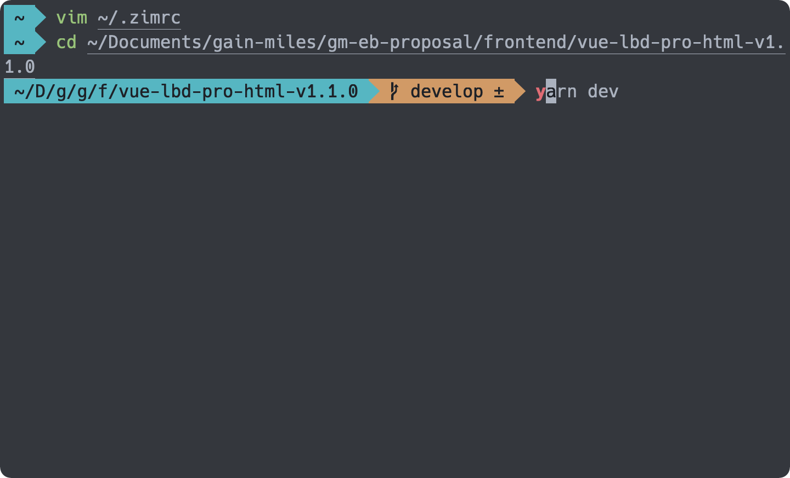

# 07 - Zim - Zsh 配置框架與它的插件

Zsh 可以讓使用者利用配置客製各種不同的功能，像是命令的自動補全、提示、高亮與縮寫等。但是要自己設定這些需要花費大量的時間，因此找一個好的框架，並且使用大家公認的大眾配置會是個比較省力的方式。

這些框架除了預配置的功能外，都會提供擴充的插件，藉由引入這些插件，我們可以輕鬆地實現各式功能，而不需要自己去做大量的配置。

## Zsh 配置框架 Zim


Zim 是個 Zsh 配置框架，它提供了豐富的預設功能，並且以高效著稱。


除了預設的功能外，使用者還可以使用 Modules 對功能進行擴充，並選擇自己喜愛的 Themes 來使用。

## 安裝 Zim

使用 Curl 安裝 Zim ：

```shell
curl -fsSL https://raw.githubusercontent.com/zimfw/install/master/install.zsh | zsh
```

安裝完成後，重新啟動終端機，就可以開始使用 Zim 所提供的各式功能了。


## Zim 的配置

Zim 的配置藉由一個配置檔 `~/.zimrc` 來處理，安裝完成後他會有預設的配置，使用者可以自己決定是否要使用這些配置。

Zim 的 Module 與 Theme 的安裝方式是相同的， 接著以 theme `eriner` 為例，展示如何配置 Zim 。

### 安裝 Module

 首先，在 `~/.zimrc` 中將 `eriner` 加入到配置：

```shell
# Zim theme
zmodule eriner
```

儲存後，使用指令安裝 Module ：

```shell
zimfw install
```

重啟終端後就可以看到新的主題效果了。



### 更新 Modules

使用指令更新所有在 `~/.zimrc` 中的 Module ：

```shell
zimfw update
```

## 刪除 Module

先將要刪除的 Module 從 `~/.zimrc` 中刪去：

```shell
# Zim theme
#zmodule eriner
```

然後使用指令解安裝 Module ：

```shell
zimfw uninstall
```

它會詢問是否要刪除，選擇是後，就會開始進行解安裝的動作。

## Zim 的預設功能

Zim 在安裝時會預設配置多個不同的 Module ，其列表如下：

```shell
# Start configuration added by Zim install {{{
# -------
# Modules
# -------

# Sets sane Zsh built-in environment options.
zmodule environment
# Provides handy git aliases and functions.
zmodule git
# Applies correct bindkeys for input events.
zmodule input
# Sets a custom terminal title.
zmodule termtitle
# Utility aliases and functions. Adds colour to ls, grep and less.
zmodule utility

#
# Prompt
#
# Exposes to prompts how long the last command took to execute, used by asciiship.
zmodule duration-info
# Exposes git repository status information to prompts, used by asciiship.
zmodule git-info
# A heavily reduced, ASCII-only version of the Spaceship and Starship prompts.
zmodule asciiship

# Additional completion definitions for Zsh.
zmodule zsh-users/zsh-completions
# Enables and configures smart and extensive tab completion.
# completion must be sourced after zsh-users/zsh-completions
zmodule completion
# Fish-like autosuggestions for Zsh.
zmodule zsh-users/zsh-autosuggestions
# Fish-like syntax highlighting for Zsh.
# zsh-users/zsh-syntax-highlighting must be sourced after completion
zmodule zsh-users/zsh-syntax-highlighting
# Fish-like history search (up arrow) for Zsh.
# zsh-users/zsh-history-substring-search must be sourced after zsh-users/zsh-syntax-highlighting
zmodule zsh-users/zsh-history-substring-search
# }}} End configuration added by Zim install
```

接著說明幾個主要的 Module 所帶來的功能是什麼。

### environment

> [GitHub 連結](https://github.com/zimfw/environment)。

此為官方的 Module ，作用為設定合理的 [Zsh 的選項](https://zsh.sourceforge.io/Doc/Release/Options.html#Options)。

> 關於 Zsh 的選項可以參考 [Moving to zsh, part 3: Shell Options](https://scriptingosx.com/2019/06/moving-to-zsh-part-3-shell-options/) 。

### git

> [GitHub 連結](https://github.com/zimfw/git)。

此為官方的 Module ，設定 Git 相關的別名與功能。


### utility

> [GitHub 連結](https://github.com/zimfw/utility)。

此為官方的 Module ，設定 `ls` 、 `grep` 與 `less` 相關的配置，包含高亮與別名。


### duration-info

> [GitHub 連結](https://github.com/zimfw/duration-info)。

此為官方的 Module ，紀錄指令執行的時間。


### git-info

> [GitHub 連結](https://github.com/zimfw/git-info)。

此為官方的 Module ，導出 Git 庫相關的資訊。


### asciiship

> [GitHub 連結](https://github.com/zimfw/asciiship)。

此為官方的 Theme ，使用 `git-info` 與 `duration-info` 顯示相關的訊息。


### completion

> [GitHub 連結](https://github.com/zimfw/completion)。

此為官方的 Module ，提供指令的相關提示，需要搭配 [`zsh-users/zsh-completions`](https://github.com/zsh-users/zsh-completions) 來提供指令的資訊補完。


### zsh-users/zsh-autosuggestions

> [GitHub 連結](https://github.com/zsh-users/zsh-autosuggestions)。

`zsh-autosuggestions` 會記憶使用者之前的指令，然後再輸入相似的指令時對使用者做提示，如果確認之後，可以使用右箭頭按鈕完成輸入。


### zsh-users/zsh-syntax-highlighting

> [GitHub 連結](https://github.com/zsh-users/zsh-syntax-highlighting)。

`zsh-syntax-highlighting` 提供 Zsh 指令高亮的顯示。


### zsh-users/zsh-history-substring-search

> [GitHub 連結](https://github.com/zsh-users/zsh-history-substring-search)。

`zsh-history-substring-search` 讓使用者可以輸入指令的一部分，然後使用上下方向鍵選取之前與現在所輸入的字串有吻合的指令。


## 其他的 Modules

Zim 提供了許多的 [Modules](https://zimfw.sh/docs/modules/) 與 [Themes](https://zimfw.sh/docs/themes/) ，可以依照需求做安裝，像是 [homebrew](https://github.com/zimfw/homebrew) 提供了 `brew` 指令的別名。

另外也有許多第三方的套件也可以使用 Zim 來管理，只要是使用 `{init.zsh,module_name.{zsh,plugin.zsh,zsh-theme,sh}}` 的檔案安裝的套件都可以，如果不是的話，也可以使用 `zmodule --source` 指定安裝的檔案。

這些第三方套件，像是 [Spaceship](https://spaceship-prompt.sh/) 、 [alias-tips](https://github.com/djui/alias-tips) 等，都可以藉由 [awesome-zsh-plugins](https://github.com/unixorn/awesome-zsh-plugins) 尋找。

## 本文重點整理

- 使用 Zim 可以快速擴充 Zsh 的功能，並且避免撰寫細部的腳本。
- Zim 的使用在於兩個關鍵字： `zimfw` 與 `zmodule` 。
- 指令 `zimfw` 可以安裝、更新與解安裝於 `~/.zimrc` 設定的套件（ Modules ）。
- `zmodule` 在 `~/.zimrc` 中設定各種想要載入的套件。
- Zim 預設載入的套件提供了：
  - 別名。
  - 當前資訊（ Git 、指令執行時間）。
  - 自動提示與補完。
  - 語法高亮。
  - 歷史指令查找。
- 除了預設套件， Zim 也提供其他許多的套件，供使用者選擇。
- 第三方套件也可以藉由 Zim 安裝。

## 參考資料

- [Zim](https://zimfw.sh/)
- [GitHub ： zimfw/zimfw](https://github.com/zimfw/zimfw)
- [GitHub ： spaceship-prompt/spaceship-prompt](https://github.com/spaceship-prompt/spaceship-prompt)
