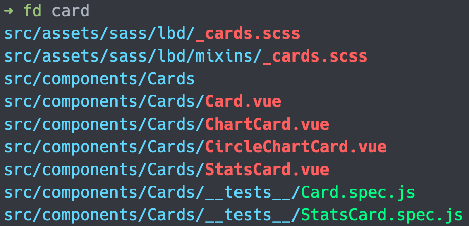

# 08 - fd - 快速查找檔案與目錄

`find` 是個在查找檔案的指令，但是它的預設行為並不是這麼的直觀，需要使用特定的參數才能以一般搜尋的思維（例如：不分大小寫，搜尋部分字串）執行，這使得 `find` 在使用上不這麼地方便，甚至因為需要記憶特定參數而容易遺忘，需要重新查找文件，帶給使用者不便。

## 更人性化的查找指令 fd

`fd` 是個指令簡單、快速且直觀的查找指令，特色如下列所示：

- 直觀的語法：用 `fd PATTERN` 取代 `find -iname '*PATTERN*'` 。
- 預設的 `PATTERN` 為正則表達式與 glob 。
- 使用多工查找目錄，因此搜尋速度快。
- 使用顏色區隔不同的檔案類型。
- 同時執行多個指令。
- 預設使用不分大小寫的方式查找，如果 `PATTERN` 包含有大寫，則使用區分大小寫的方式搜尋。
- 預設忽略隱藏檔案。
- 依照 `.gitignore` 的規則忽略檔案。

## 安裝 fd

使用 Homebrew 安裝 `fd` ：

```shell
brew install fd
```

安裝完成後，就可以使用 `fd` 來進行查找了。

## 使用 fd

直接使用 `fd` 指令，在沒有任何參數的情況下會列出當前目錄下所有的檔案與目錄：

```shell
fd
```

在後面加上參數 `PATTERN` ：

```shell
fd card
```

`fd` 會以不區分大小寫，並忽略隱藏檔案（包含 `.gitignore` ）的方式對 `PATTERN` 進行查找。



`fd` 會以顏色區分不同類型的檔案。

`fd` 有豐富的設定供使用者找到目標，可以使用 `fd --help` 觀看詳細的說明。接下來會介紹幾個常用的操作。

### 正規表達式搜尋

`fd` 支援正規表達式：

```shell
> fd '^c.*d$'
gm-eb-proposal/frontend/vue-lbd-pro-html-v1.1.0/CHANGELOG.md
gm-eb-proposal/third-party/theme/light-bootstrap-dashboard-pro/CHANGELOG.md
```

`fd` 所使用的正規表達式語法可以參考 [Docs.rs](https://docs.rs/regex/1.0.0/regex/#syntax)。

### 搜尋特定目錄

在第二個參數輸入目錄，搜索範圍就會被限縮於此目錄中。

```shell
fd card Documents/code
```

上例只會搜尋 `Documents/code` 中與 `card` 字串相符的檔案。

### 搜尋特定副檔名

使用 `-e` 可以搜尋擁有特定副檔名的檔案。

```shell
fd card -e vue
```

上例只會搜尋副檔名為 `vue` 中與 `card` 字串相符的檔案。

### 搜尋特定檔名

`fd` 預設會搜尋目錄與檔案，而且只需要匹配部分字串即可，如果要只搜尋特定檔案的話，可以使用 `-g` （ glob ）參數。

```shell
fd -g card.vue
```

上例只會搜尋名為 `card.vue` 的檔案。

### 搜尋忽略的檔案

`fd` 預設不會查找隱藏檔案，使用 `-H` （或 `--hidden` ）來查找：

```shell
fd -H pre-commit
```

範例可以在原本隱藏的 `.git` 目錄中查找 `pre-commit` 。

`fd` 預設會將 `.gitignore` 設定的目錄及檔案忽略，使用 `-I` （或 `--no-ignore` ）來查找：

```shell
fd -I @vue
```

範例可以在原本被 `.gitignore` 忽略的 `node_modules` 中查找 `@vue` 。

### 使用查找到的檔案執行指令

使用者查找檔案通常的目的都是用這些檔案去**執行特定的指令**做處理， `fd` 提供了執行指令的方式：

- `-x` ／ `--exec` ：每個結果分別帶入指令**同步**執行。
- `-X` ／ `--exec-batch` ：所有的結果一起帶入指令執行（只執行一次）。

```shell
> fd -g '*.js' -x yarn prettier --write
prettier --write config/storybook/main.js
prettier --write config/storybook/preview.js
```

上例會將每個搜索到的 `.js` 檔案給予 `yarn lint:prettier` 作為參數執行。

如果將 `-x` 改為 `-X` ，會是所有的路徑以空白分開帶入指令：

```shell
> fd -g '*.js' -X yarn prettier --write
prettier --write config/storybook/main.js config/storybook/preview.js
```

#### 使用 Placeholder 語法

`fd` 使用 Placeholder 語法讓使用者決定要怎麼將結果帶入指令中。

```shell
fd -g '*.js' -x yarn prettier --write {}
```

上例在指令的後面加上 `{}` ，表示要使用完整的結果作為參數，會跟沒有設定時是一樣的效果。

這裡介紹各個 Placeholder 語法：

- `{}` ：完整的路徑，此為預設。（ `config/storybook/main.js` ）
- `{.}` ：剔除副檔名。（ `config/storybook/main` ）
- `{/}` ：只保留最後一層。（ `main.js` ）
- `{//}` ：剔除最後一層。（ `config/storybook` ）
- `{/.}` ：只保留最後一層並剔除副檔名。（ `main` ）

### 排除檔案或目錄

使用 `-E` （或 `--exclude` ）排除檔案或目錄：

```shell
fd test -H -E .git
```

上例搜尋 `test` 要包含隱藏檔案，但是要排除 `.git` 目錄。

## 本文重點整理

- `find` 指令用以搜索檔案與目錄，但其使用方式不直觀，造成使用者需要花時間習慣與記憶。
- `fd` 指令是 `find` 的優化版本，提供直觀的使用方式，並且提供高效的搜尋體驗。
- 指令 `fd` 會列出當前目錄所有的檔案與目錄。
- 指令 `fd PATTERN` 會列出所有與 `PATTERN` 吻合的檔案與目錄。
- 指令 `fd PATTERN /foo/bar` 只會搜尋 `/foo/bar` 下的檔案與目錄。
- 指令 `fd -e md` 只會搜尋副檔名為 `md` 的檔案。
- 指令 `fd -H foo` 會連同隱藏檔案都搜尋。
- 指令 `fd -I foo` 會連 `.gitignore` 忽略的檔案都搜尋。
- 指令 `fd foo -x echo` 會將搜尋結果一個個帶給指令 `echo` 同步做處理。
- 指令 `fd foo -X echo` 會將搜尋結果同時帶給指令 `echo` 做處理。
- `fd -x` 所設定的指令可以利用 Placeholder 語法決定要如何帶入搜尋結果。
- 指令 `fd foo -E foo` 會將 `foo` 目錄或檔案排除在結果外。

## 參考資料

- [GitHub ： sharkdp/fd](https://github.com/sharkdp/fd)
