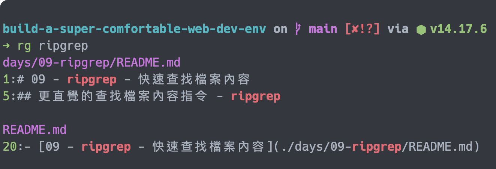
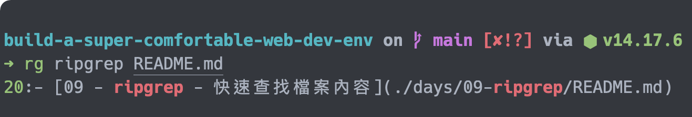

# 09 - ripgrep - 快速查找檔案內容

`grep` 是查找檔案中內容的指令，在一般的作業情境下， `grep` 的功能是十分足夠了，但是在開發作業時， `grep` 的某些預設就顯得比較不合需求，例如只針對特定檔案、不會顯示行數與不會排除 `.gitignore` 中忽略的檔案等。雖然大部分的功能都可以藉由特定的參數設定完成，但是多了參數就多了需要記憶的部分，也比較不直覺，因此使用一個專為開發設計的查找內容工具是個提升產能的方式。

## 更直覺的查找檔案內容指令 - ripgrep

`ripgrep` 提供使用者直覺的內容查找指令，利用直觀的使用方式，我們可以輕鬆無負擔的找到需要的資料。

它有下面的特色：

- 包含了大部分其他搜尋內容的指令，而且速度更快（參考[與其他的搜尋工具的比較](https://github.com/BurntSushi/ripgrep#quick-examples-comparing-tools) ）。
- 依循 ignore 檔案的設定，例如 `.gitignore` ，會將其所設定的範圍排除在搜尋外，並會自動忽略隱藏檔案與 binary 。
- 可以針對特定的副檔名進行搜尋。
- 支援許多 `grep` 的功能，像是顯示結果的上下文、搜尋多個 patterns 、搜尋字串的高亮等。
- 支援除了 UTF-8 外的其他編碼，像是 UTF-16 、 latin-1 、 GBK 、 EUC-JP 、 Shift_JIS 等。
- 可以搜尋壓縮的檔案。
- 在搜尋前，可以執行預處理器，處理一些原本無法搜尋的格式，例如 PDF 。

## 安裝 ripgrep

使用 Homebrew 安裝 `ripgrep` ：

```shell
brew install ripgrep
```

安裝完成後，就可以使用 `rg` 指令叫用 `ripgrep` 了。

```shell
rg --help
```

`--help` 參數會列出說明供使用者參照。

## 使用 ripgrep

`rg` 的使用需要帶有 `PATTERN` 參數，這就是搜尋的目標。

```shell
rg ripgrep
```

上例的 `ripgrep` 就是 `PATTERN` 參數，這個指令會去查找**當前目錄下所有檔案**內容中有 `ripgrep` 的結果。



如果想要搜尋特定檔案，可以使用第二個參數指定檔案。

```shell
rg ripgrep README.md
```

上例只會查找 `README.md` 中的內容。



`ripgrep` 支援**正規表達式**的搜尋方式，因此你可以使用正規表達式的語法設定搜尋的 `PATTERN` 。

```shell
rg ' rip\w+'
```

上例會搜尋 `rip` 字串前面是空白，並且後面接一個以上字元的結果。

> 關於正規表達式的設定方式，可以參考 [Docs.rs 的文件](https://docs.rs/regex/1.5.4/regex/#syntax)。

上面就是 `ripgrep` 主要的使用方式，接下來會介紹幾個常用的搜尋情境供使用者參考。

### 忽略的檔案

`ripgrep` 的搜尋會依照對應的規則忽略特定的檔案，如果在搜尋時，遇到下面的情況，會對其做忽略的動作：

- 與下列檔案中設定的 glob 相符時：
  - `.gitignore` （全域及本地）。
  - `.ignore` ，如果與 `.gitignore` 衝突，會以 `.ignore` 為先。
  - `.rgignore` ，如果與 `.ignore` 衝突，會以 `.rgignore` 為先。
- 隱藏的檔案與目錄。
- Binary 檔案（ `ripgrep` 用 `NUL` 判斷是否為 binary ）。
- Symlinks 。

`ripgrep` 提供了各式的參數，供使用者需要查詢這些忽略檔案時使用：

- 使用 `--no-ignore` 將 ignore 檔案包含在搜尋範圍內。
- 使用 `--hidden` 將隱藏檔案與目錄包含在搜尋範圍內。
- 使用 `--text` （或 `-a` ）將 binary 包含在搜尋範圍內。
- 使用 `--follow` （或 `-L` ）將 symlinks 包含在搜尋範圍內。

`ripgrep` 另外提供了 `--unrestricted` （或 `-u` ）、 `-uu` 與 `-uuu` ：

- `-u` ：搜尋範圍包含 ignore 檔案設定的檔案或目錄。
- `-uu` ：搜尋範圍包含 ignore 檔案設定與隱藏的檔案或目錄。
- `-uuu` ：搜尋範圍包含 ignore 檔案設定、隱藏的檔案與 binary 檔案或目錄。

> 如果不知道為什麼找不到目標的結果時，可以使用 `--debug` 參數，它會列出細節供使用者參考。

### 指定搜尋範圍

在指令中使用 `-g` 參數，可以自己指定搜尋範圍。

```shell
rg ripgrep -g '*.md'
```

上例就只會搜尋 `.md` 結尾的檔案。

### 指定特定檔案類型

在指令中使用 `--type` （或 `-t` ）參數，可以設定要搜尋的類型。

```shell
rg ripgrep --type md
# equal
rg ripgrep -tmd
```

上例只會搜尋 `md` 類型的檔案。

另外，也可以使用 `-T` 排除特定的類型：

```shell
rg ripgrep -Tmd
```

這樣就不會搜尋 `md` 類型的檔案了。

## 本文重點整理

- `grep` 預設不是給予開發者使用，因此部分指令會較不直觀，需要特別去記憶，拖慢查找的時間。
- `ripgrep` 針對開發時的情境設計指令，因此可以輕鬆且直覺的使用 `ripgrep` 來針對開發相關的檔案做檢索。
- `ripgrep` 指令為 `rg` 。
- `rg PATTERN` 會搜索當前目錄下所有檔案中含有 `PATTERN` 內容的結果。
- `rg PATTERN PATH` 會搜索特定 PATH 中含有 `PATTERN` 內容的結果。
- `PATTERN` 可以是正規表達式。
- `rg` 預設搜尋時會忽略部分檔案，其忽略的範圍如下：
  - 使用 ignore 檔案設定的檔案或目錄。
  - 隱藏的檔案或目錄。
  - Binary 檔案。
  - Symlinks 。
- 使用特定參數可以尋找被忽略的檔案或目錄：
  - 查找 ignore ： `--no-ignore` 與 `-u` 。
  - 查找隱藏的檔案或目錄： `--hidden` 。
  - 查找 binary 檔案： `--text` 。
  - 查找 Symlinks ： `--follow` 。
  - 查找 ignore 與隱藏的檔案或目錄： `-uu` 。
  - 查找 ignore 、隱藏的檔案或目錄與 binary 檔案： `-uuu` 。
- 使用 `-g` 指令查找的 glob 。
- 使用 `-t` 指定查找檔案的類型。
- 使用 `-T` 指定排除的檔案類型。

## 參考資料

- [GitHub ： BurntSushi/ripgrep](https://github.com/BurntSushi/ripgrep)
- [ripgrep User Guide](https://github.com/BurntSushi/ripgrep/blob/9b01a8f9ae53ebcd05c27ec21843758c2c1e823f/GUIDE.md)
