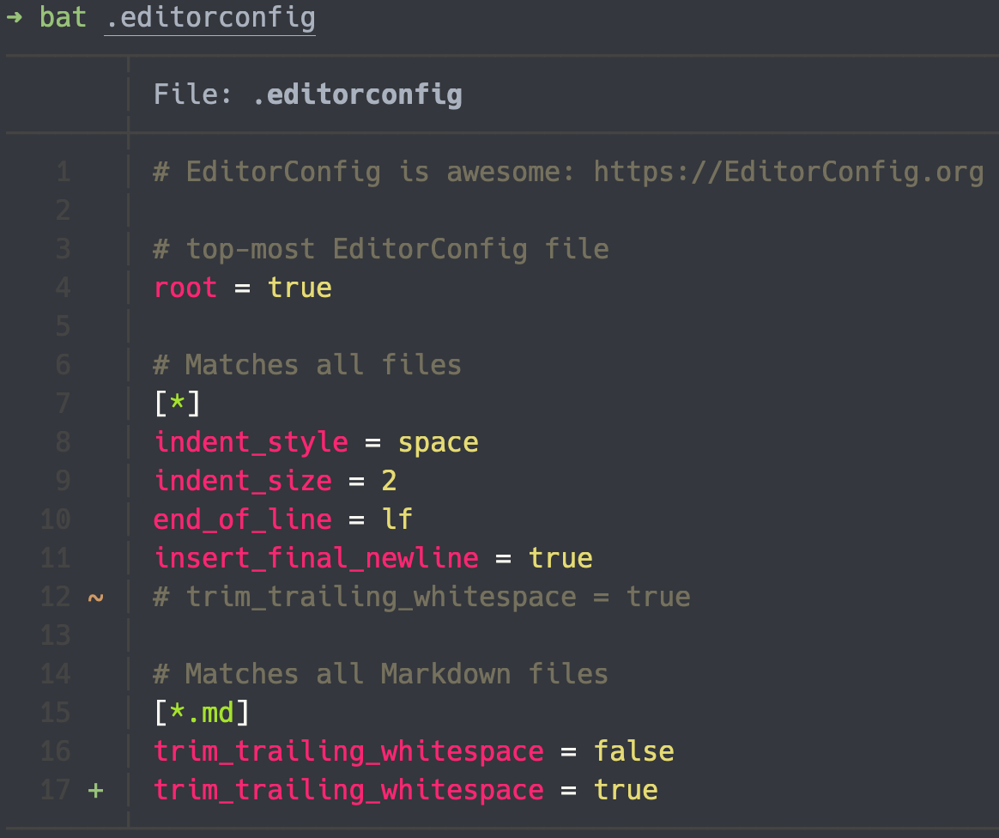
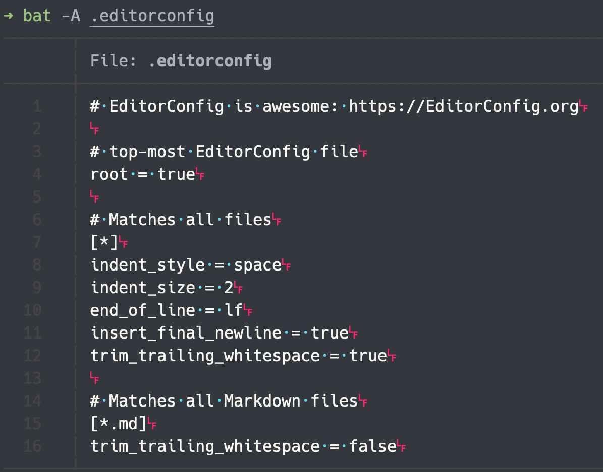
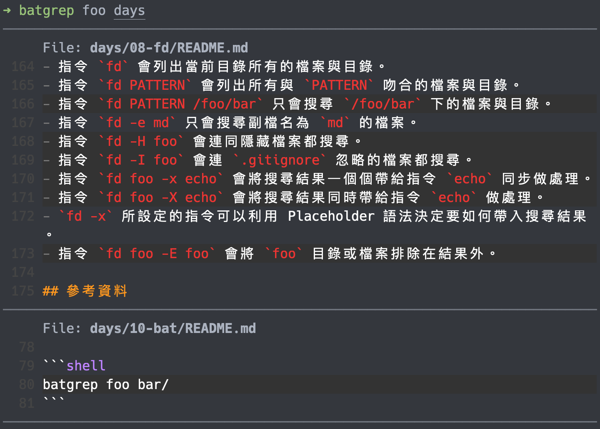

# 10 - BAT - 使用高亮預覽文件

`cat` 指令可以預覽文件的內容，是個簡單好用的指令，但是它不會對不同的檔案類型提供語法高亮的預覽，因此看起來會有點吃力。

## 專為開發而生的預覽指令 BAT


BAT 是個 `cat` 指令的加強版，它特別針對開發者的需求，導入了包含語法高亮、整合 Git 等功能，使開發者可以更輕鬆、方便地預覽程式碼。

## 安裝 BAT

使用 Homebrew 安裝 BAT ：

```shell
brew install bat
```

安裝完成後，可以使用 `bat` 指令叫用。

## 使用 BAT

`bat` 與 `cat` 的使用方式類似，在參數中輸入想要預覽的檔案路徑，就可以觀看預覽。

```shell
bat .editorconfig
```



這個例子我們可以看到語法的高亮顯示，並且在左邊有以符號表示 Git 狀態的標示。

如果加上 `-A` 參數，我們可以看到平常不會顯示的字元，例如空白或換行。

```shell
bat -A .editorconfig
```



如果想要同時預覽多個檔案，可以使用 glob 來替換指定的檔案路徑。

```shell
bat days/**/*.md
```

上例會將所有在 `days` 目錄下，不管階層地輸出預覽所有的 `.md` 檔案內容。

除了從檔案讀取內容外， `bat` 也提供 stdin 的輸入。

```shell
curl -s https://raw.githubusercontent.com/sharkdp/bat/master/CONTRIBUTING.md | bat
```

`bat` 會自動判斷內容的類型（只會以第一行判斷，例如 `#!/bin/sh` ），並提供相關的語法高亮，也可以使用 `-l` 指定格式。

```shell
curl -s https://raw.githubusercontent.com/sharkdp/bat/master/CONTRIBUTING.md | bat -l md
```

## 整合其他的工具

`bat` 可以與許多不同的工具整合，這裡介紹幾個常用的工具。

### fd

> 請確認已經安裝 `fd` 。

`fd` 指令可以使用 `-X` （或 `--exec-batch` ）提供搜尋結果的預覽功能：

```shell
fd -H -e js -X bat
```

上例會產生所有 `js` 檔案的預覽。

### ripgrep

> 請確認已經安裝 `ripgrep` 。

使用 [`batgrep`](https://github.com/eth-p/bat-extras/blob/master/doc/batgrep.md) 可以為 `ripgrep` 所搜尋的結果帶來更好的預覽效果。

在使用前須要先安裝 [`bat-extras`](https://github.com/eth-p/bat-extras) ，這個工具提供許多工具與 BAT 的整合使用。

```shell
brew install eth-p/software/bat-extras
```

安裝完成後，我們就可以使用 `batgrep` 指令叫用 `ripgrep` 找尋結果並使用 `bat` 顯示預覽。

```shell
batgrep foo days/
```



## 本文重點整理

- `cat` 提供的檔案預覽功能，對於開發來說，較為簡單。
- `bat` 提供語法高亮與 Git 整合的預覽功能，對於開發者較為合適。
- `bat -A` 會顯示隱藏的字元，例如空白或換行。
- 除了檔案內容外， `bat` 還提供 stdin 的輸入方式。
- 使用 `bat -l` 可以指定語言高亮的目標。
- `bat` 可以與其他工具整合。
  - `fd` 與 `bat` 可以使用 `-X` 參數結合，讓我們可以預覽搜尋結果的檔案內容。
  - `ripgrep` 與 `bat` 可以藉由 `batgrep` 工具整合，讓搜尋結果使用 `bat` 預覽。

## 參考資料

- [GitHub ： sharkdp/bat](https://github.com/sharkdp/bat)
- [GitHub ： eth-p/bat-extra](https://github.com/eth-p/bat-extras)
