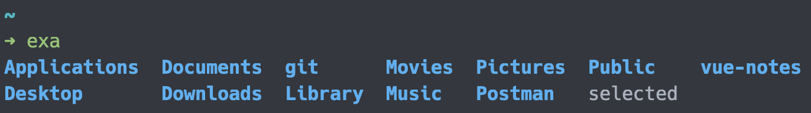
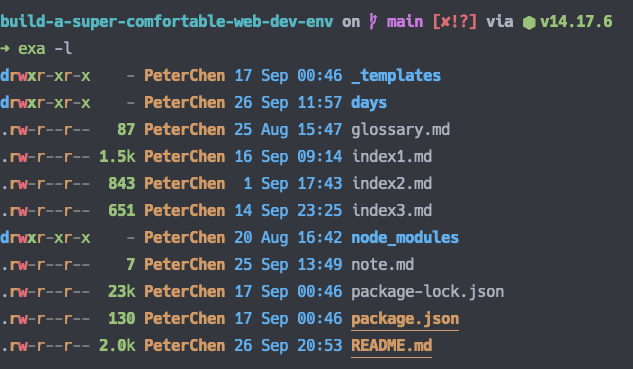
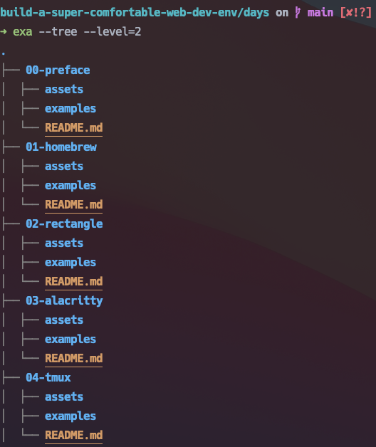
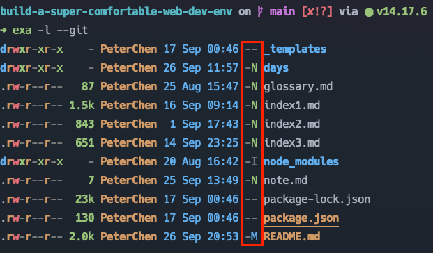
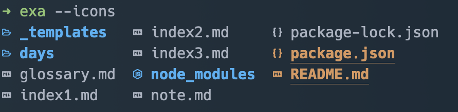

# 11 - exa - 總覽目錄的工具

`ls` 指令會列出目錄中的各個檔案與目錄，供使用者瀏覽整個目錄的結構，是個十分常用的指令。

但它的設計考量到以前電腦的效能，所擁有的功能較為陽春，一切都是以減少執行時間與空間下去考量的，因此對於使用者來說，就需要自己花時間對 `ls` 輸出的訊息下去做分析或輸入進一步的指令以取得想要的資訊。

來到今天，電腦的效能已經不在是個問題了，因此使用者值得一個更人性化的工具來減少需要耗費的精力。

## 現代化的目錄總覽工具 - exa

`exa` 是個目錄總覽的指令工具，它以顏色區分檔案的類型、資訊，並且用有樹狀總覽的功能，在開發方面也與 Git 整合，讓開發者可以清楚地知道每個檔案目前的狀態。

## 安裝 exa

使用 Homebrew 安裝 `exa` ：

```shell
brew install exa
```

安裝完成後，可以使用 `exa` 叫用。



## 使用 exa

除了專屬功能外， `exa` 的使用方式與 `ls` 大致上相同。

`exa` 會以 grid 的模式列出當前目錄內的檔案與目錄（與加上 `--grid` 時相同，此為預設模式），並且以顏色區分各個不同的類型。

```shell
exa
```

加上 `-l` 會輸出各個目錄及檔案的細節資訊，此模式稱為 long 。

```shell
exa -l
```



在各個資訊上不僅上了顏色，檔案容量也轉為人所能理解的單位。

加上 `--tree` 後可以瀏覽樹狀結構，並且可以用 `--level` 設置輸出的層數。

```shell
exa --tree --level=2
```



在 grid 與 tree 模式下都可以加上 `-l` 來對檔案與目錄輸出細部資訊。

```shell
# long view in the grid
exa --grid -l

# long view in the tree
exa --tree -l
```

當目錄是個 Git 庫時，可以在 long 模式下使用 `--git` 輸出 Git 資訊。

```shell
exa -l --git
```



Git 資訊中會有兩個狀態符號：

- N ：新的檔案。
- M ：修改過的已存在檔案。

如果想要更清楚地辨別各種檔案與目錄，可以使用 `--icons` 參數，它會在檔名前面加上對應的類型圖示。

```shell
exa --icons
```



## 整合 Zim 的 Module

[Zim](../07-zimfw-and-plugins/README.md) 有提供一個官方的 Module `exa` ，安裝這個 Module 後可以得到別名與更優地預設。

在 `~/.zimrc` 中加上 `exa`

```shell
zmodule exa
```

然後執行 `zimfw install` 安裝 Module 並重啟終端機。

如此一來，我們可以直接使用[別名](https://github.com/zimfw/exa#aliases)來叫用 `exa` ，變得更加方便。

## 本文重點整理

- `ls` 作為總覽目錄的指令，其所顯示的方式與資訊都較為不變與陽春。
- `exa` 是個現代化的 `ls` 指令，提供顏色提示類型與資訊、 Git 整合與樹狀結構，來提昇整體的有用訊息。
- `exa` 指令預設使用 grid 模式，作為輸出的方式。
- 使用 `-l` 啟用 long 模式，藉此得到更多的細部資訊。
- 使用 `--tree` 啟用 tree 模式，輸出樹狀結構，並以 `--level` 來設置輸出的層數。
- 在 grid 與 tree 模式下，都可以使用 `-l` 輸出詳細資訊。
- 當目錄在 Git 庫中時，可以使用 `--git` 輸出 Git 的資訊。
- 使用參數 `--icons` 可以在檔案前輸出圖示，以增加各類型的識別度。
- 搭配 Zim 的 Module ，可以得到別名與更佳地預設。

## 參考資料

- [exa](https://the.exa.website/)
- [GitHub ： ogham/exa](https://github.com/ogham/exa)
- [GitHub ： zimfw/exa](https://github.com/zimfw/exa)
