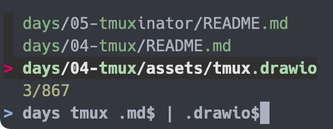
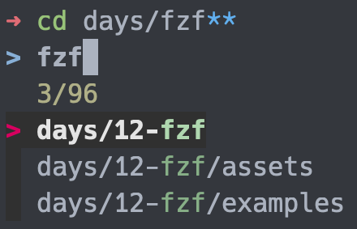
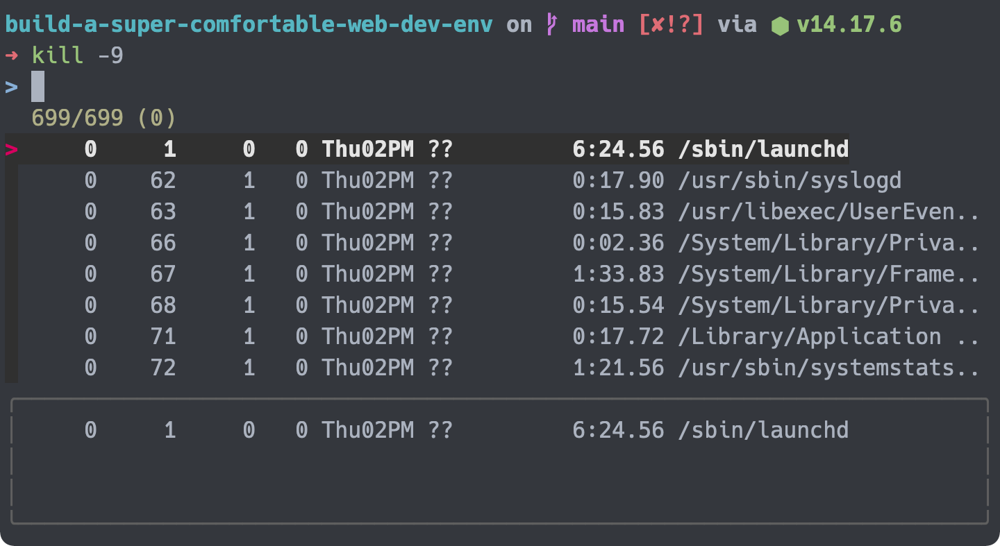
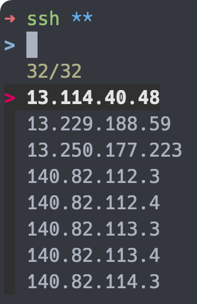
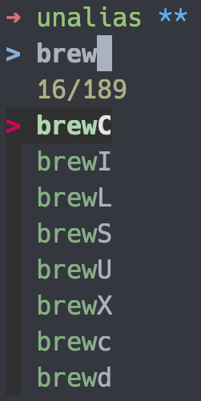
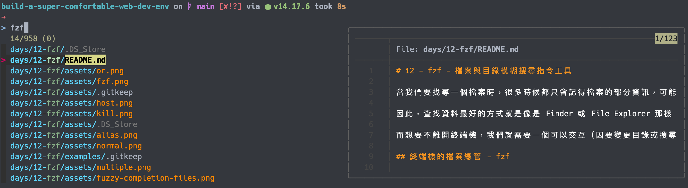

# 12 - fzf - 檔案與目錄模糊搜尋指令工具

當我們要找尋一個檔案時，很多時候都只會記得檔案的部分資訊，可能是部分的路徑或是名稱，我們可以使用這些資訊對電腦下達 `find` 或 `fd` 之類的查找指令，但是人的記憶總有疏漏，可能這些資訊是錯誤或是過於籠統的，我們必須要再次地增刪查找字串來取得想要的結果，這樣一來一往，我們會使用很多的查找指令，在這樣的來回輸入時，時間就會被浪費了。

因此，查找資料最好的方式就是像是 Finder 或 File Explorer 那樣可以輕鬆地進出上下層目錄，並且提供搜尋功能的應用程式。

而想要不離開終端機，我們就需要一個可以交互（因要變更目錄或搜尋對象）的查找指令。

## 終端機的檔案總管 - fzf


`fzf` 是個命令列的模糊搜尋器，它會以輸入字串為搜尋目標，列出可能的結果清單，使用者可以在這個清單上選擇出符合的結果，如果沒有期望的結果，也可以即時地刪除或增加資訊，藉以找到目標。

## 安裝 fzf

使用 Homebrew 安裝 `fzf` ：

```shell
brew install fzf
```

安裝完成後，還要另外執行 `fzf` 的 `install` 腳本：

```shell
$(brew --preview)/opt/fzf/install
```

> 腳本的路徑取決於 Homebrew 的安裝路徑，因此需要使用 `brew --preview` 取得安裝目錄。

此腳本會進行鍵的綁定與模糊補全的設置。

執行完成後，請重新啟動終端機，讓安裝生效。

## 使用 fzf

執行 `fzf` 命令就可以叫出當前目錄的列表，使用者可以輸入字串來限縮列表的結果。

```shell
fzf
```


預設輸入的字串是採取模糊搜尋，因此只要有匹配的目錄或檔案就會輸出在結果上。

除了模糊搜尋， `fzf` 提供了各種前綴（ prefix ）讓我們使用不同的搜尋方式：

| 輸入字串  | 動作         | 說明                               |
| --------- | ------------ | ---------------------------------- |
| `sbtrkt`  | 模糊匹配     | 與 `sbtrkt` 中的任意字元匹配的物件 |
| `'wild`   | 精確匹配     | 與 `wild` 字串匹配的物件           |
| `^music`  | 前綴精確匹配 | 物件的開頭需是 `music` 字串        |
| `.mp3$`   | 後綴精確匹配 | 物件的結尾需是 `.mp3` 字串         |
| `!fire`   | 反向精確匹配 | 物件中不能有 `fire` 字串           |
| `!^music` | 反向前綴匹配 | 物件的開頭不能是 `music` 字串      |
| `!.mp3$`  | 反向後綴匹配 | 物件的結尾不能是 `.mp3` 字串       |

輸入多個字串時， `fzf` 會以 AND （且）的搜尋方式處理各個字串，如果要使用 OR （或）搜尋的話，可以使用 `|` 隔開多個字串。

```shell
days tmux .md$ | .drawio$
```



當在列表上看到期望的目標時，我們可以使用下面的方式操作 `fzf` 以選取結果：

- 使用 `CTRL-K` ／ `CTRL-J` （或 `CTRL-P` ／ `CTRL-N` ）上下移動。
- 點擊 `Enter` 選取物件。
- 使用 `CTRL-C` ／ `CTRL-G` ／ `ESC` 離開 `fzf` 。
- 使用滑鼠選取。

加上 `-m` 參數，可以開啟多選模式：

```shell
fzf -m
```

在多選模式下可以使用 `TAB` 與 `Shift-TAB` 上下多選物件。


如要取消選擇，可以在以選取的物件上再輸入一次 `TAB` 或 `Shift-TAB` 。

## 快捷鍵

`fzf` 預設三個快捷鍵供使用者使用：

- `CTRL-T` ：所選的物件會貼至命令列。
- `CTRL-R` ：開啟歷史指令列表，所選的指令會貼至命令列。
- `ALT-C` ：會移動至所選的目錄。

## 模糊補全

有時，我們會在下指令時忘記目標的完整名稱，這時我們可以使用 `fzf` 的模糊補全功能來找到想要的物件。

### 檔案與目錄

`fzf` 的檔案與目錄的模糊補全是使用 `**` 作為關鍵字，並按下 `TAB` 後觸發，它的定義為 `COMMAND [DIRECTORY/][FUZZY_PATTERN]**<TAB>` 。

```bash
# 當前目錄下搜尋
cd **<TAB>

# 當前目錄下搜尋 `fzf`
cd fzf**<TAB>

# `days` 目錄下搜尋 `fzf`
cd days/fzf**<TAB>
```



### 程序 ID

當想要關閉特定的程序時，我們會使用 `kill` 指令， `fzf` 會智能地判斷指令，並輸出程序列表。

```bash
kill -9 <TAB>
```



此狀態下 `fzf` 為多選模式，可以使用 `TAB` 與 `Shift-TAB` 選取多個程序。

### Host 名稱

在輸入 `ssh` 與 `telnet` 指令時， `fzf` 會從 `/etc/hosts` 與 `~/.ssh/config` 中取得 Host 名稱列表。

```bash
ssh **<TAB>
telnet **<TAB>
```



### 環境變數／別名

在輸入環境變數與別名相關的指令時， `fzf` 會取得其列表。

```bash
unset **<TAB>
export **<TAB>
unalias **<TAB>
```



## 與 Zim 整合

Zim 官方提供了 [`fzf` 的 Module](https://github.com/zimfw/fzf) ，它將 `fzf` 的搜尋指令以 `fd` 或 `ripgrep` 取代預設的 `find` ，並且在按下 `CTRL-T` 時，使用 `BAT` 進行預覽的動作。

> 需要先安裝 [`fd`](../08-fd/README.md) （或 [`ripgrep`](./../09-ripgrep/README.md) ）與 [BAT](./../10-bat/README.md) 。



## 本文重點整理

- `fzf` 是個命令列的模糊搜尋器，在查找物件時使用。
- 輸入 `fzf` 或是鍵入 `CTRL-T` 開啟檔案與目錄查找。
- 鍵入 `CTRL-R` 查找歷史指令。
- 鍵入 `ALT-C` 移動至查找的物件。
- 在搜尋時， `fzf` 提供各種前綴字來修改原本預設的模糊搜尋方式。
  - `'` ：完整搜尋。
  - `^` ：開頭相符。
  - `$` ：結尾相符。
  - `!` ：反向搜尋。
- 使用鍵盤選取物件時：
  - `CTRL-K` ／ `CTRL-J` （或 `CTRL-P` ／ `CTRL-N` ）移動。
  - `Enter` 選取。
  - `CTRL-C` ／ `CTRL-G` ／ `ESC` 離開。
- 使用滑鼠可以在列表的各個物件中移動與選取。
- 在輸入不同指令時，可以使用 `TAB` 來啟動模糊補全。
  - 預設使用 `**<TAB>` 開啟檔案與目錄列表。
  - `kill` 指令： `TAB` 輸入開啟程序列表。
  - `ssh` 與 `telnet` 指令： `**<TAB>` 輸入開啟 Host 名稱列表。
  - 環境變數與別名指令： `**<TAB>` 輸入開啟變數或別名列表。
- 與 Zim 的 `fzf` Module 整合，可以讓 `fzf` 使用 `fd` （或 `ripgrep` ）及 BAT 優化功能。

## 參考資料

- [GitHub ： junegunn/fzf](https://github.com/junegunn/fzf)
- [Youtube ： Vim universe. fzf - command line fuzzy finder](https://youtu.be/qgG5Jhi_Els)
- [GitHub ： zimfw/fzf](https://github.com/zimfw/fzf)
- [reddit ： FZF newcomer: fd or ripgrep?](https://www.reddit.com/r/linux4noobs/comments/egb644/fzf_newcomer_fd_or_ripgrep/)
