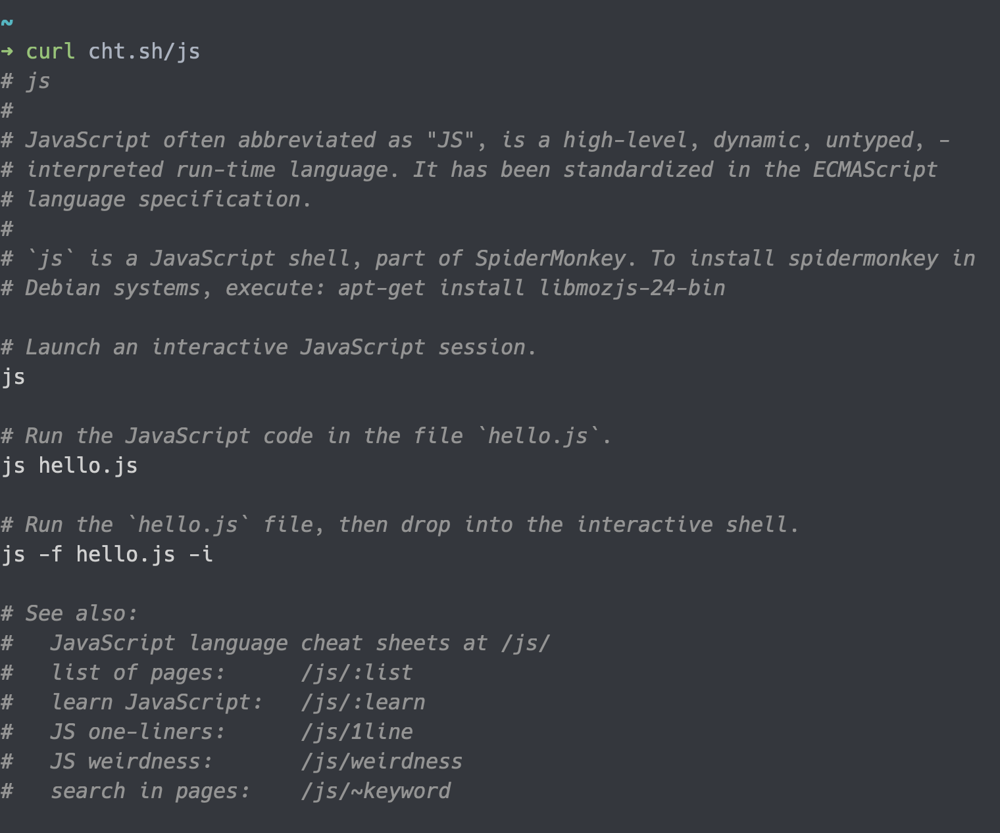
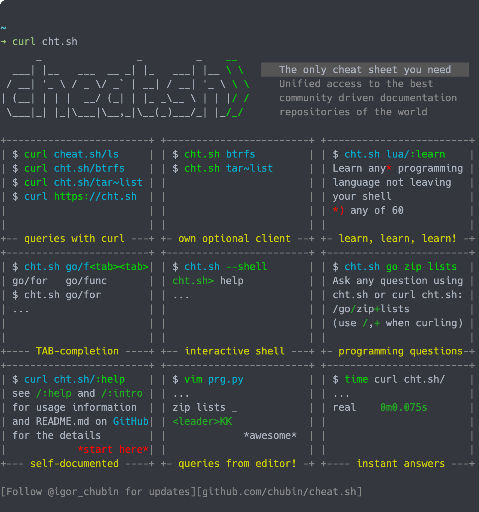
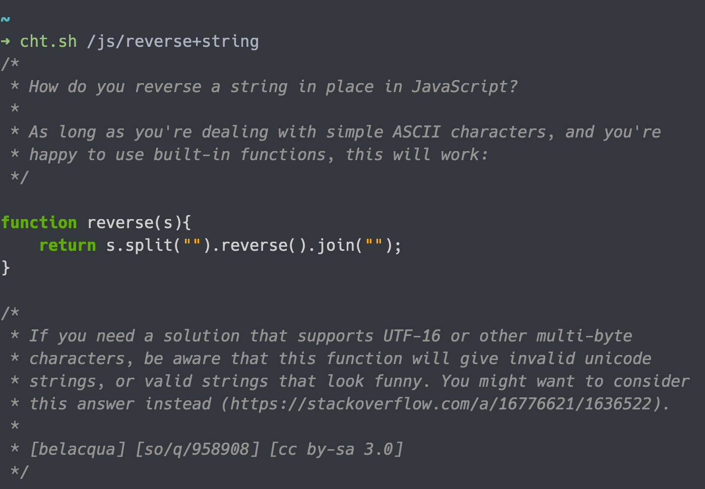

# 13 - cheat.sh - 終端機的程式百科全書

在開發時，開發者常常會需要在瀏覽器上搜尋指令或程式語言相關的說明，藉此來輔助並確保使用的方式正確。但是每次的搜尋都需要消耗時間，並且從各個資源中找到有參考價值的資料更是耗費精神，使開發效率降低。

## 終端機中的程式資訊查找器 - cheat.sh

cheat.sh 是個針對終端機環境所設計的 cheat sheet 工具，它[匯集了網路上許多的資源](https://github.com/chubin/cheat.sh#cheat-sheets-sources)，並將它們整理起來，只要使用特定的搜尋參數，就可以取得對應的資訊與說明，藉以省去使用瀏覽器查詢的麻煩。



## 與 `man` 的差異

指令 `man` 是我們常用的搜尋指令，它可以叫出指令的說明文件，但是這些說明文件大多都是龐大的，它會將所有的參數一個個說明，也缺少範例，因此對於想要速查的需求是比較缺乏的。

cheat.sh 提供的是精簡的說明，搭配大量的範例使我們可以快速查找，以應付開發所需的資訊。

## 安裝 cheat.sh

cheat.sh 可以直接使用 `curl` 指令執行，因此並不需要安裝的動作，除非你想要：

- [指令列的客戶端](https://github.com/chubin/cheat.sh#command-line-client-chtsh)：較 `curl` 的版本有更多的功能，例如 shell 模式、搜尋歷程、剪貼簿整合、 自動補全與 stealth 模式。
- [獨立版本](https://github.com/chubin/cheat.sh/blob/6d83c4d76c82a87cf6df436a5ab73e3b7c819e66/doc/standalone.md)：此為離線版本，只有當你需要使用的環境為離線狀態時，或是需要自己客製 chat sheets 才需要安裝。

本文使用 `curl` 版本講解，可以依照需求，安裝適合你的版本。

## 使用 curl cheat.sh

cheat.sh 可以縮寫為 cht.sh ，直接下 `curl cht.sh` ，會輸出 cheat.sh 的 cheat sheet 。

```bash
curl cht.sh
```



如果想要取得 cht.sh 的使用方式說明，可以使用 `:help` 路由。

```bash
curl cht.sh/:help
```

上例會列出所有的使用方式與參數。

## 使用關鍵字搜索

如果一開始不知道要搜尋什麼的話，可以使用關鍵字搜尋，在搜尋字串前面加上 `~` 表示要使用關鍵字搜尋。

```bash
curl cht.sh/~snapshot
```

關鍵字搜尋有三個選項，加在搜尋字串的下一層路由就可以作用：

```bash
# 不分大小寫搜尋
curl cht.sh/~snapshot/i

# 搜索字不為其他字的子字串
curl cht.sh/~snapshot/b

# 遞歸搜尋
curl cht.sh/~snapshot/r
```

## 搜索主題

如果想要查詢有什麼樣的 cheat sheet ，可以使用 `:list` 列出所有的主題。

```bash
> curl -s cht.sh/:list | rg js
ajson
js
js/
js/1line
js/:learn
js/:list
js/Comments
js/Functions,_Scope_and_Closures
js/Logic_and_Control_Structures
js/Numbers,_Strings_and_Operators
js/Prototypes
js/Variables,_Arrays_and_Objects
js/hello
js/rosetta/
js/weirdness
jshint
jslint
json5
jstack
nodejs
```

由於列表項目較多，可以使用 `ripgrep` 之類的工具做進一步的篩選。

找到目標的語言或指令後，將名稱帶入路由中，就可以取得對應的 cheat sheet 。

```bash
# Language
curl cht.sh/js

# Command
curl cht.sh/ls
```

在第一層決定了目標的指令或語言後，我們可以針對此目標進行近一步的搜索。

## 搜索主題內容

要搜索內容，可以直接將想要搜尋的關鍵字打在下一層路由上，並且空白以 `+` 取代。

```bash
curl cht.sh/js/reverse+string
```



上例為搜尋 `js` 的反轉字串的方法。

如果你覺得 cheat.sh 所找到的答案不符合你的需求的話，可以在下層加上隨機的參數（例如 `/1` 、 `/2` ）， cheat.sh 會找尋其他的結果。

```bash
curl cht.sh/js/reverse+string
curl cht.sh/js/reverse+string/1
curl cht.sh/js/reverse+string/2
```

### 反向搜尋

如果在搜尋時，我們想要剔除特定的字串，可以使用 `+-` 串接想要排除的字串。

```bash
curl cht.sh/python/multiply+matrices+-numpy
```

上例會搜尋 `python` 的矩陣乘法，但不使用 `numpy` 。

### 搜尋的選項

在搜尋的下一層加上 `\?` 後面接選項，就可以使用選項的效果。

```bash
curl cht.sh/js/reverse+string\?Q
```

假設只想要輸出程式碼，不想要有註解，可以下 `\?Q` 來去除註解。

```bash
curl cht.sh/js/reverse+string\?QT
```

如果同時不想要有註解與顏色的話，可以使用 `\?QT` ，當然，單獨使用 `\?T` 去除顏色，也是可以的。

其他的選項可以由 `curl cht.sh/:help` 中查找。

### 程式語言的內容

程式語言的內容會有複數個特殊的路由：

```bash
# 入門文件
curl cht.sh/js/hello

# 列出所有此語言的主題
curl cht.sh/js/:list

# 學習文件
curl cht.sh/js/:learn

# 此語言有用的單行程式碼集
curl cht.sh/js/1line

# 此語言的特別之處說明
curl cht.sh/js/weirdness
```

### 本文重點整理

- 平常搜尋語言或指令的用法時，需要使用瀏覽器搜索，並且要靠自己篩選來源。
- 使用 `cheat.sh` 不僅可以直接在終端機上查詢，其來源也是來自於可信任的資源。
- `cheat.sh` 的 `curl` 版本不用安裝，可以直接使用。
- 路由輸入 `~KEYWORD` 可以以 `KEYWORD` 為關鍵字搜尋。
- 使用 `:list` 可以列出所有的主題，並藉由 `ripgrep` 工具幫忙篩選。
- 決定主題後，可以使用 `+` 合併要搜尋的名詞進行搜尋。
- 如果要剔除特定關鍵字，可以使用 `+-` 。
- 語言相關的主題可以使用特殊的字串來查找特殊的資源。
  - `hello` ：入門文件。
  - `:list` ：列出所有此語言的主題。
  - `:learn` ：學習文件。
  - `1line` ：此語言有用的單行程式碼集。
  - `weirdness` ：此語言的特別之處說明。

## 參考資料

- [cheat.sh](https://cheat.sh/)
- [GitHub ： chubin/cheat.sh](https://github.com/chubin/cheat.sh)
