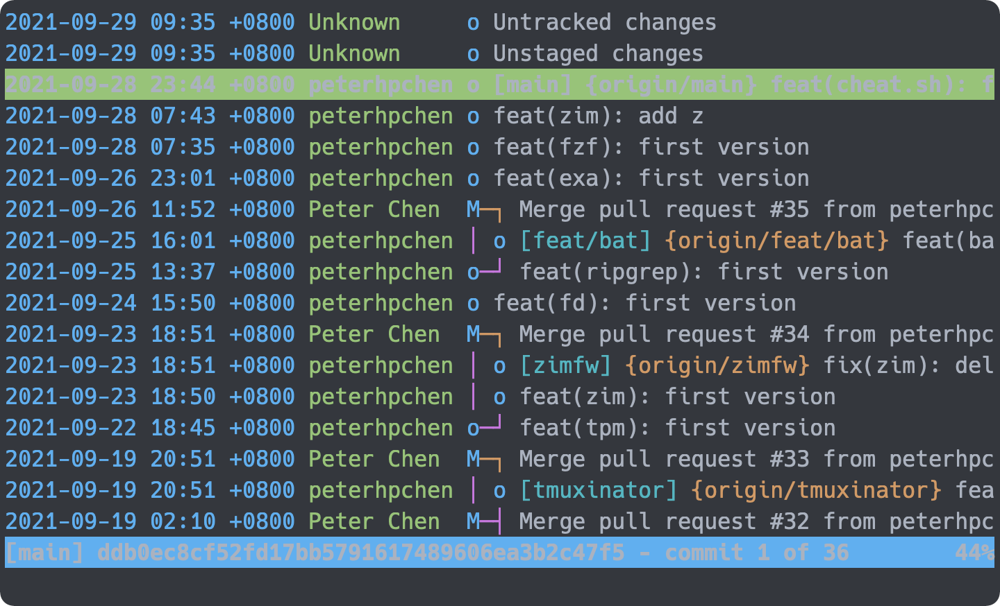
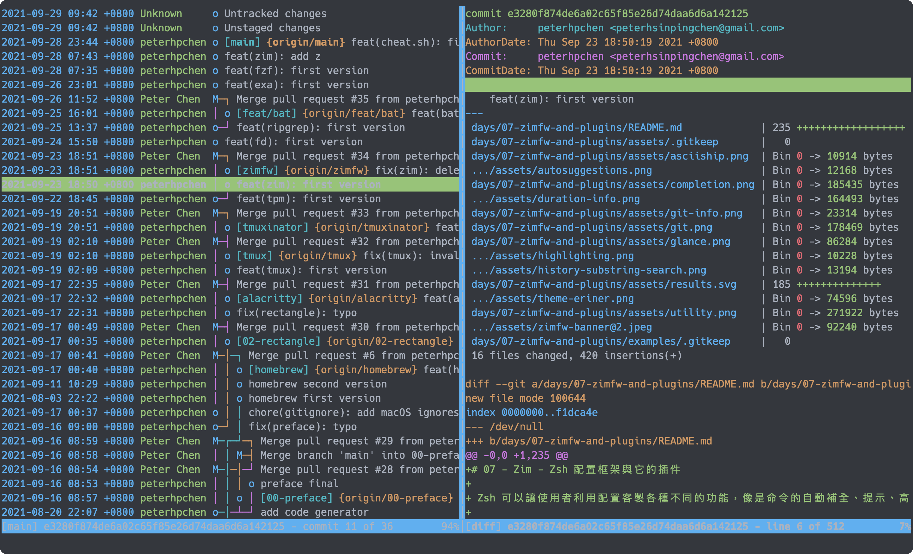
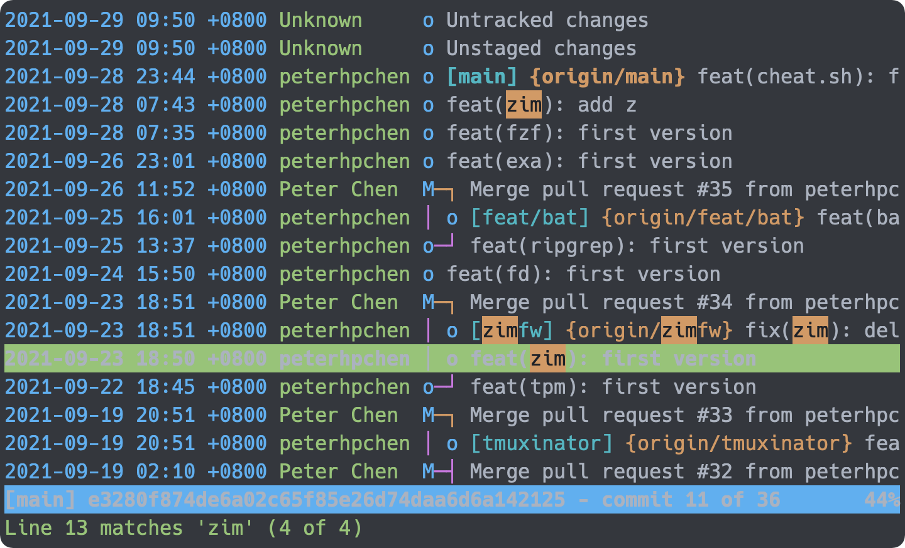

# 14 - tig - git 的文字介面

Git 是開發者們最常接觸到的工具之一，大部分的專案都使用它作為版本控制的工具。使用者可以直接用 `git` 指令對 Git 進行不同的操作，而使用者需要查閱各種資訊（例如 `status` 、 `log` 等）時，也可以使用指令叫用 Git 來輸出對應的資料。

但是 Git 本身在控制版本時有圖形（分支）的概念，並且有許多的檔案與列表，在查閱時需要頻繁地來回以比較不同，這使得以文字來提供資訊的 `git` 會較難提供使用者一個清晰的說明。

許多人會選擇改用 GUI 工具來操作 Git ，但是這樣做就是多了一個視窗，多走了一步，此舉勢必會降低效率。

## 直觀地 Git 介面命令工具 - tig

`tig` 是個命令列工具，它可以將 Git 的資訊更直觀地顯示出來，並且在切換檔案、 Commit 等的時候，可以使用按鍵進行切換，而不需要再輸入一次命令。

## 安裝 tig

使用 Homebrew 安裝 `tig` ：

```bash
brew install tig
```

安裝完成後，可以使用命令 `tig` 啟動功能。

## 使用 tig

直接輸入 `tig` ，它會將目前分支中的 Commit 列表顯示出來。

```bash
tig
```



可以看到它會描繪出其他分支合併的狀態，以線與點的方式呈現。

> 在 `tig` 內，可以直接按下 `h` 查閱各個指令。

使用 `j` 與 `k` 鍵上下移動，如果想要觀看 Commit 的詳細資訊，可以移至目標 Commit 後按下 `Enter` 。



你可以看到它會列出這個 Commit 的資訊與修改的檔案及內容，如果要快速移動到特定的檔案內容，可以使用 `j` 或 `k` 移動到想要查閱的檔案上並按下 `Enter` 。

如果要切換回 Commit 列表的話，可以使用 `TAB` 在兩個視窗間來回切換，如果不想要切換的話，可以使用 `J` 與 `K` 改變選取的 Commit 。

如果想要將視窗放到最大的話，可以使用 `O` （大寫字母）。

想要關閉 `tig` 時，輸入 `Ctrl-C` 就可以退出 `tig` 。

## 搜尋

在 `tig` 內，可以輸入 `/` ，後面輸入想要搜尋的字串，就可以進行查找，並利用 `n` 與 `N` 在各個結果間切換。



## 在各個不同的視窗間切換

當我們在 `tig` 內時，我們可以使用各種快捷鍵在不同功能的視窗間切換：

| 快捷鍵     | 前置條件                       | 動作                             |
| ---------- | ------------------------------ | -------------------------------- |
| `m`        | 不需要                         | 顯示主視窗                       |
| `d`        | 選取 Commit 或在特定 Commit 內 | 顯示 Diff 視窗                   |
| `l`        | 不需要                         | 顯示 Log 視窗                    |
| `L`        | 不需要                         | 顯示 Reflog 視窗                 |
| `t`        | 選取 Commit 或在特定 Commit 內 | 顯示目錄                         |
| `f`        | 選取特定的檔案                 | 顯示檔案內容                     |
| `b`        | 選取特定的檔案                 | 顯示 Blame 視窗                  |
| `r`        | 不需要                         | 顯示 Refs （分支與標籤列表）視窗 |
| `s` 或 `S` | 不需要                         | 顯示 Status 視窗                 |
| `c`        | 選取 stage 檔案                | 顯示 Stage 視窗                  |
| `y`        | 不需要                         | 顯示 Stash 視窗                  |
| `g`        | 不需要                         | 搜索 Git History 中的內容        |
| `h`        | 不需要                         | 開啟 Helper 視窗                 |

## 本文重點整理

- 指令 `git` 的資訊顯示較為陽春，無法交互地選擇與切換各個檔案、分支。
- `tig` 是個 Git 的文字介面，它可以使用交互的方式在各個不同的視窗切換，並取得 Git 相關的資訊。
- `tig` 會直接進入 `tig` 工具中，可以瀏覽目前分支與 Commit 的狀態。
- `j` 與 `k` 可以上下移動。
- `Enter` 可以進入 Commit 節點，查看詳細的修改。
- `TAB` 可以在不同視窗間切換。
- `J` 與 `K` 可以再不離開細節視窗下切換 Commit 節點。
- `O` 可以將視窗放大。
- `Ctrl-C` 可以離開視窗。
- 在 `tig` 中，可以使用快捷鍵切換各種視窗。
  - `m` 可以切換至主視窗。
  - `l` 切換至 Log 視窗。
  - `t` 切換至當前 Commit 節點的目錄。
  - `f` 切換至檔案內容視窗。
  - `b` 切換至 Blame 視窗。
  - `s` 切換至 Status 視窗。
  - `y` 切換至 Stash 視窗。
  - `h` 切換是 Helper 視窗。

## 參考資料

- [Tig](https://jonas.github.io/tig/)
- [GitHub ： jonas/tig](https://github.com/jonas/tig)
