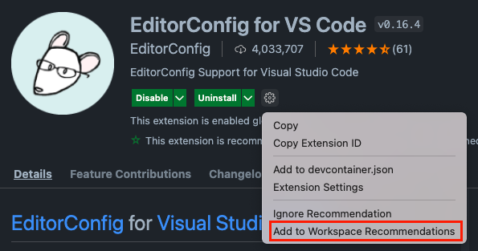

# EditorConfig

不同的編輯器預設的輸入方式都不盡相同，因此同個專案的同個檔案使用不同的編輯器修改，可能會因為輸入的格式不同，而使整體的格式不一致，造成閱讀與管理上的困難。

一般的解決方式是直接修改編輯器內輸入的相關設定，使其匹配專案的設定，但是每個編輯器的設定方式不同，同個效果的配置屬性也可能不同，難以確保設定後的一致性。

## 介紹 EditorConfig


EditorConfig 是由專案中的配置文件與各式編輯器的插件所組成的，藉由使用的編輯器插件讀取配置文件，從而將編輯器的設定修改為與 EditorConfig 的配置一致。

EditorConfig 使用的配置文件在不同的編輯器中都是相同的設定方式，使用這個所有編輯器共用的配置做設定，搭配編輯器中 EditorConfig 的插件做解析並轉為各個編輯器原生的設定，使輸入方式在不同的編輯器之間達成一致。

## 使用 EditorConfig

要使用 EditorConfig ，有兩點需要學習：

- EditorConfig 配置檔
- 在編輯器中安裝 EditorConfig 插件

### EditorConfig 配置檔

EditorConfig 使用名為 `.editorconfig` 的檔案作為配置文件，下面是個 `.editorconfig` 的範例：

```ini
# EditorConfig is awesome: https://EditorConfig.org

# top-most EditorConfig file
root = true

# Matches all files
[*]
indent_style = space
indent_size = 2
end_of_line = lf
insert_final_newline = true
trim_trailing_whitespace = true

# Matches all Markdown files
[*.md]
trim_trailing_whitespace = false
```

`.editorconfig` 採用 [INI 檔案](https://en.wikipedia.org/wiki/INI_file)格式編寫，以 `name = value` 配置各個設定， `name` 為設定屬性， `value` 為設定值，設定會被 `[]` 隔為一個個的 section ， section 名稱（例如： `*.md` ）是以 [globs](<https://en.wikipedia.org/wiki/Glob_(programming)>) 設定（區分大小寫）的檔案路徑（類似 [gitignore](https://git-scm.com/docs/gitignore#_pattern_format) 的設定方式）， section 內（從 `[]` 行到下個 `[]` 行或是檔案結尾）的所有設定都會作用在與 section 名稱相符的檔案上。

使用者依照專案的習慣將各種檔案的設定（設定屬性可以在 [EditorConfig Wiki](https://github.com/editorconfig/editorconfig/wiki/EditorConfig-Properties) 中檢索）配置於 `.editorconfig` 中。

在使用者開啟專案中的任一檔案時，編輯器的插件會從當前目錄開始往上層搜索 `.editorconfig` 配置檔，直到 root 目錄或是取得的 `.editorconfig` 中設定 `root = true` 為止。

可以在專案中配置多個 `.editorconfig` ， EditorConfig 會將搜索過程中的配置合併，離開啟檔案越進優先權越大，而配置檔內的設定由上而下，越下面的 section 優先權越大。

> 可以參考[實際專案的配置方式](https://github.com/editorconfig/editorconfig/wiki/Projects-Using-EditorConfig)。

### 在編輯器中安裝 EditorConfig 插件

EditorConfig 依照編輯器的支援種類，分為**原生支援**與**依靠插件支援**的兩類：

- 原生支援：編輯器本身就支援 EditorConfig 的配置，像是 WebStorm 、 Visual Studio 等，完整列表可以參照 [EditorConfig No Plugin Necessary](https://editorconfig.org/#pre-installed) ）。
- 依靠插件支援：編輯器本身不支援 EditorConfig ，但通過安裝插件可實現其功能，像是 Visual Studio Code 、 Atom 等，完整列表可以參照 [EditorConfig Download a Plugin](https://editorconfig.org/#download) 。

## 在 Visual Studio Code 中使用 EditorConfig

由於 Visual Studio Code 原生並不支援 EditorConfig ，因此需要另外安裝插件 [EditorConfig for VS Code](https://marketplace.visualstudio.com/items?itemName=EditorConfig.EditorConfig) ，安裝完成後就可以直接設定 `.editorconfig` 開始使用。

VS Code 的 EditorConfig 目前支援下列屬性：

- `indent_style`
- `indent_size`
- `tab_width`
- `end_of_line` (on save)
- `insert_final_newline` (on save)
- `trim_trailing_whitespace` (on save)

只要依照 EditorConfig 規定的設定相關的配置屬性，就可以給每個人的編輯器帶來相同的輸入配置。

### 將 EditorConfig 插件加入 VS Code 專案

為了讓專案的其他使用者可以順利的安裝插件，我們可以將插件加入推薦清單中。



在插件的介紹頁上按下**設定的齒輪**，並且選擇 **Add to Workspace Recommendations** ，就可以將其加入清單。

或者也可以直接開啟 `.vscode/extensions.json` 進行編輯：

```json
{
  "recommendations": ["editorconfig.editorconfig"]
}
```

## 本文重點整理

- 現今的編輯器多元，而每個編輯器的設定方式都不盡相同，要使用各編輯器的原生設定來確保專案中每個人的輸入方式是很困難的。
- EditorConfig 可以使用單一設定方式統一跨編輯器輸入規範，當使用了 EditorConfig 配置後，所有參與開發的人都能享有一致的規範。
- 使用 EditorConfig 的方式是依照專案需求編輯 `.editorconfig` ，並在編輯器中安裝插件來執行相關的配置修改。
- 依照不同的編輯器與環境， EditorConfig 的支援分為兩個：**原生支援**與**依靠插件支援**。
- Visual Studio Code 要使用 EditorConfig ，必須依靠插件支援。
- 可以將 EditorConfig 的插件加入 VS Code 專案的插件推薦清單中，其他的使用者可以依照清單安裝需要的插件。

## 參考資料

- [EditorConfig](https://editorconfig.org/)
- [EditorConfig Specification](https://editorconfig-specification.readthedocs.io/)
- [freeCodeCamp: Why You Should Use EditorConfig to Standardize Code Styles](https://www.freecodecamp.org/news/how-to-use-editorconfig-to-standardize-code-styles/)
- [EditorConfig for VS Code](https://marketplace.visualstudio.com/items?itemName=EditorConfig.EditorConfig)
