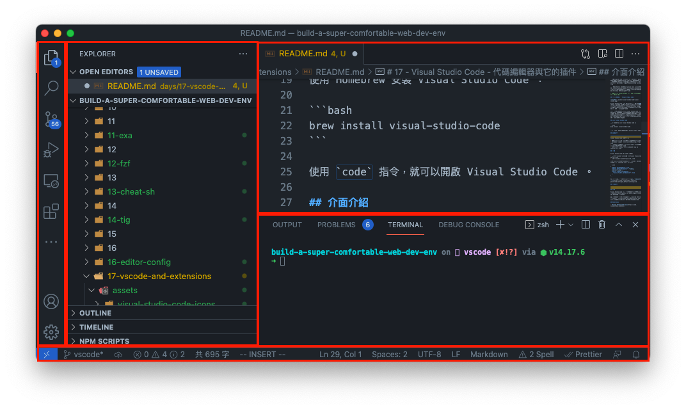
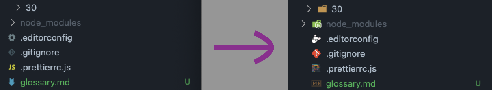
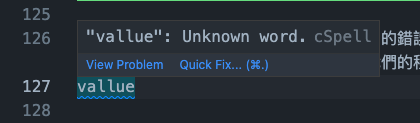
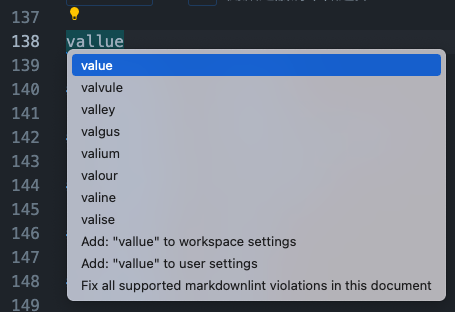
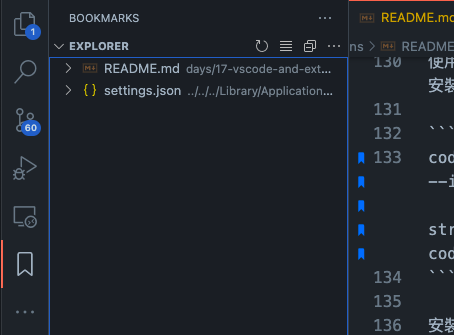
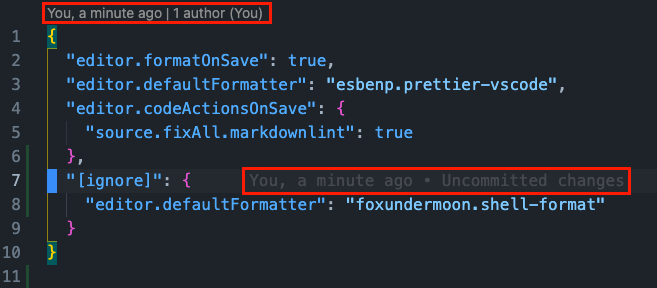
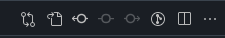

# 17 - Visual Studio Code - 代碼編輯器與它的插件

一般功能豐富的 IDE ，都會針對它所支援的語言提供許多強大的輔助功能，例如 PyCharm ，但它們所需的容量與資源會較單純的編輯器大上許多，並且因為只支援特定語言的關係，如果有其他語言的專案時，則需要另外安裝其他的 IDE 才能進行開發。

而所謂的 Editor （例如： Sublime Text ），雖然與 IDE 相比相當的輕量，但大部分都只支援語法高亮等簡單的開發輔助，在瀏覽文件或程式碼時較為適合，但真正到了開發時，還是必須藉由 IDE 才能提高產能。

> 例如在使用 Visual Studio 作為 IDE ， Notepad++ 作為 Editor 。

## 程式碼編輯器 - Visual Studio Code


Visual Studio Code 是由 Microsoft 主導開發的[開源](https://github.com/Microsoft/vscode/)程式碼編輯器，在這個輕量的編輯器中包進了自動完成、 debug 、版本控制等功能，並藉由其豐富的外掛插件的幫助，實現了大部分語言的專用 IDE 所能做到的事情。

作為一個免費的開源軟體， Visual Studio Code 在 IDE 與 Editor 間取得了一個微妙的平衡，就本身來說，它是一個優秀的 Editor ，它支援語法高亮、自動完成、縮排、程式碼片段等豐富的編輯功能，而當你安裝了特定語言的開發插件後，搭配它的 Debug 與任務執行器，使它可以接近（甚至超越）IDE 所給予的開發效率。

## 安裝 Visual Studio Code

使用 Homebrew 安裝 Visual Studio Code ：

```bash
brew install visual-studio-code
```

使用 `code` 指令，就可以開啟 Visual Studio Code 。

## 介面介紹



Visual Studio Code 介面分為：

- 編輯器：位於中間區塊，可以將檔案分群，放於不同的位置。
- 側邊欄：位於左邊區塊，顯示檔案瀏覽器、搜尋、 Git 等資訊。
- 狀態欄：位於最下方行，顯示當前檔案狀態，例如編碼、檔案格式、錯誤、警告等資訊。
- Panels ：位於下方區塊，顯示各套件 logs 、 terminal 等資訊。

## 設置

Visual Studio Code 的設定分為兩種：

- 使用者設定：此設定會影響所有 Visual Studio Code 所開啟的專案。
- 專案設定：此設定只會被特定專案使用。

專案設定是在專案的根目錄下建立 `.vscode` 的目錄，並在目錄內使用 `settings.json` 做設定：

```json
{
  "editor.formatOnSave": true,
  "editor.defaultFormatter": "esbenp.prettier-vscode",
  "editor.codeActionsOnSave": {
    "source.fixAll.markdownlint": true
  }
}
```

Key 是設定的屬性，可以在官網中找到[屬性的說明以及它的預設值](https://code.visualstudio.com/docs/getstarted/settings#_default-settings) 。

## 插件介紹

VS Code 的擴充插件十分多元，其中也有許多很實用的插件，有些甚至會影響整個開發的流程，這裡簡單介紹幾個便利的插件，幫助開發者在工作時更加地順利。

接下來的介紹會分為下面幾個使用面向：

- 主題類：編輯器外觀與顯示方式的優化。
- 編輯類：為開發者在編輯時帶來便利。
- 開發類：優化程式開發時的效率。

### 主題類之一： vscode-icons

> [插件頁面連結](https://marketplace.visualstudio.com/items?itemName=vscode-icons-team.vscode-icons)。

VS Code 預設只會判斷少部分的檔案來給予不同的圖示，對於開發上的辨識度較低。 vscode-icons 不僅會用副檔名判斷，還以檔名來辨識不同的類型，給予特殊的圖示，例如像是 `.editorconfig` 這樣的設定檔，它就可以顯示出專屬的圖示，讓使用者可以快速找到想要的檔案。



使用 `code` 指令進行安裝：

```bash
code --install-extension vscode-icons-team.vscode-icons
```

安裝完成後，將設定中的 `workbench.iconTheme` 改為 `vscode-icons` 。

```json
{
  "workbench.iconTheme": "vscode-icons"
}
```

儲存後就可以看到效果。

### 主題類之二： GitHub Theme

> [插件頁面連結](https://marketplace.visualstudio.com/items?itemName=GitHub.github-vscode-theme)。

GitHub 主題插件讓使用者在使用 VS Code 時，也能擁有與 GitHub 上相同的風格。

使用 `code` 指令進行安裝：

```bash
code --install-extension GitHub.github-vscode-theme
```

安裝完成後，開啟 VS Code 的設定，將 `workbench.colorTheme` 改為 `GitHub Dark Dimmed` 。

```bash
{
  "workbench.colorTheme": "GitHub Dark Dimmed"
}
```

GitHub Theme 總共有提供下列主題：

- `GitHub Light Default`
- `GitHub Dark Default`
- `GitHub Dark Dimmed`
- `GitHub Dark High Contrast`

使用者可以依據喜好做調整。

### 編輯類之一： Code Spell Checker

> [插件頁面連結](https://marketplace.visualstudio.com/items?itemName=streetsidesoftware.code-spell-checker)。

在寫程式時，偶爾會因輸入過快而導致拼寫的錯誤， Code Spell Checker 可以給予使用者拼寫錯誤的提醒，避免錯字進入我們的程式碼庫中。



使用 `code` 指令進行安裝：

```bash
code --install-extension streetsidesoftware.code-spell-checker
```

安裝完成後，當輸入的字有拼寫錯誤時，會有藍色線條做提醒，使用者可以使用 `Command` ＋ `.` 開啟建議清單做選擇。



### 編輯類之二： Bookmarks

> [插件頁面連結](https://marketplace.visualstudio.com/items?itemName=alefragnani.Bookmarks)。

Bookmarks 可以讓我們在不同的檔案與行中留下記號，並且經由指令跳轉，省下許多的時間。

使用 `code` 指令進行安裝：

```bash
code --install-extension alefragnani.bookmarks
```

在想要標記的行按下 `Command-Option-K` 就可以建立標記，在已標記的行再次按下 `Command-Option-K` 就可以刪除標記。

並且可以使用 `Command-Option-L/J` 在各個標記間切換。

要觀看全部的標記狀態時，可以開啟 Bookmarks 的側邊欄總覽專案中的所有標記。



### 編輯類之三： Markdown All in One

> [插件頁面連結](https://marketplace.visualstudio.com/items?itemName=yzhang.markdown-all-in-one)。

Markdown 是個語法簡單，但是功能強大的文檔格式，可以單純依靠輸入的語法產生各式各樣的樣式。

Markdown All in One 套件是個使用 VS Code 撰寫文件時的好幫手，它提供了很多的快捷鍵，來加速各種樣式的插入，藉以提升整體的效率。

使用 `code` 指令進行安裝：

```bash
code --install-extension yzhang.markdown-all-in-one
```

其所提供的快捷鍵有很多，像是 `Ctrl-B` 可以讓選取得字串變為 Bold ，在列表內按下 `Enter` 會自動插出列表行等。

### 編輯類之四： shell-format

> [插件頁面連結](https://marketplace.visualstudio.com/items?itemName=foxundermoon.shell-format)。

shell-format 是個格式化工具，它可以格式化 `hellscript` 、 `Dockerfile` 、 `properties` 、 `gitignore` 、 `dotenv` 、`hosts` 、 `jvmoptions` 等。

使用 `code` 指令進行安裝：

```bash
code --install-extension foxundermoon.shell-format
```

將 shell-format 設定預設的格式化工具：

```json
{
  "editor.defaultFormatter": "foxundermoon.shell-format"
}
```

然後使用 `shift-option-f` 就可以對當前的檔案進行格式化。

如果想要在儲存時格式化的話，可以設定：

```json
{
  "editor.formatOnSave": true
}
```

由於 shell-format 並不適合用在所有的檔案中（例如： `.js` ），因此我們可以將它從全域的格式化工具中改為特定格式的工具：

```json
{
  "[ignore]": {
    "editor.defaultFormatter": "foxundermoon.shell-format"
  }
}
```

### 開發類之一： GitLens

> [插件頁面連結](https://marketplace.visualstudio.com/items?itemName=eamodio.gitlens)。

GitLens 為 VS Code 提供了完整的預覽功能，我們可以使用 GitLens 在 VS Code 中瀏覽 Commit 、 Change 、 Blame 等資訊。

使用 `code` 指令進行安裝：

```bash
code --install-extension eamodio.gitlens
```

安裝完成後，可以直接看到當前檔案最近的 Commit 資訊，並且所在行也有最近修改的資訊。



並且可以在檔案的右邊狀態列開啟 GitLens 的各種功能，包括檔案的 Blame 、 History 等。



### 開發類之二： Docker

> [插件頁面連結](https://marketplace.visualstudio.com/items?itemName=ms-azuretools.vscode-docker)。

Docker 插件可以在編輯 Docker File 與 Docker Compose 時提供提示、自動補全。

使用 `code` 指令進行安裝：

```bash
code --install-extension ms-azuretools.vscode-docker
```

## 本文重點整理

- Visual Studio Code 作為一個輕量的程式碼編輯器，藉由插件的幫助，可以達到接近 IDE 的開發效率，在純編輯器與 IDE 之間取得一個平衡。
- 因為插件的彈性，開發者不需要再使用不同的 IDE ，只需要針對專案的語言，選擇適合的插件，就可以擁有與 IDE 相同的功能，減少需要安裝與適應複數個開發工具的麻煩。
- 常用的插件主要為三類：
  - 主題類：外觀優化，例如 vscode-icons 與 GitHub Theme 。
  - 編輯類：更有效率的編輯，例如 Code Spell Checker 、 Bookmarks 、 shell-format 與 Markdown All in One 。
  - 開發類：提供開發上的幫助，例如 GitLens 與 Docker 。

## 參考資料

- [Visual Studio Code Docs](https://code.visualstudio.com/docs)
- [Visual Studio Code Extensions Marketplace](https://marketplace.visualstudio.com/)
