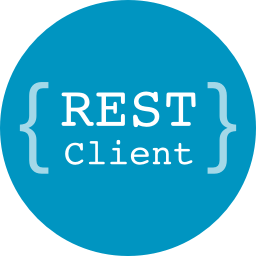
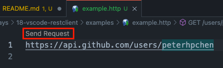
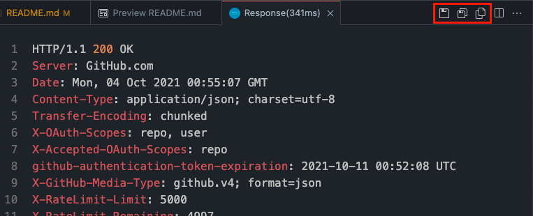

# 18 - Rest Client - HTTP 請求工具

在寫網頁時，前端的工程師需要了解如何與後端或是其他的第三方服務溝通，在看了文件後，除了直接實作外，另一個方式就是使用 HTTP client 設定請求來叫用這些 API 並接收回應，以此來了解該如何設定與這些 API 的溝通。

可是要使用 HTTP client 時，需要再開啟另一個程序，並且每次要使用時都需要跳出編輯器的工作視窗，去另一個程序操作，十分的麻煩且不順。

## VS Code 中的 HTTP Client - REST Client



[REST Client](https://marketplace.visualstudio.com/items?itemName=humao.rest-client) 是個 VS Code 的插件，它提供了完整的 HTTP Client 功能，使用它時，不用跳出 VS Code ，使用者直接編輯一份請求文件， REST Client 就會以這個文件上所設定的方式去請求各個 API ，並將回應直接輸出在 VS Code 中，這樣一來，在開發時就不用跳出編輯器，使我們可以避免切換視窗帶來的損耗。

## 安裝 REST Client

使用 `code` 指令安裝 REST Client 插件：

```bash
code --install-extension humao.rest-client
```

這樣一來，我們就完成 REST Client 的安裝了。

## 使用 REST Client

要使用 REST Client 時，先新增一個副檔名為 `.http` 的檔案，檔名依照使用者的喜好取名即可（例如： `example.http` ），接著將請求的目標 URL 輸入至檔案內：

```http
https://api.github.com/users/peterhpchen
```

可以在 URL 的上方看到 `Send Request` 的按鈕，按下去後，右邊視窗就會出現 API 的回應結果。



除了上方的 `Send Request` 按鈕外， REST Client 還有另外幾個執行方式：

- `Command-Option-R` 。
- 對著 URL 按右鍵，選擇 `Send Request` 。
- 使用 `F1` 開啟 Command Palette ，然後輸入 `Rest Client: Send Request` 。

直接設定 URL 的方式雖然簡單，但卻很難應對複雜的 API 請求，因此 REST Client 供使用者使用 [RFC 2616](https://www.w3.org/Protocols/rfc2616/rfc2616-sec5.html) 標準，來設定每個請求，如此一來，我們就可以更細部地設定像是請求方式、表頭、 body 等。

```http
POST https://api.github.com/markdown HTTP/1.1
Accept: application/vnd.github.v3+json

{
  "text": "## Hello, markdown!"
}
```

上例以 POST 方法叫用了 GitHub API 的 `/markdown` ，並加入表頭 `Accept` 與 body 。

如果需要在單個 `.http` 檔案中設定多個請求，可以用 `###` 隔開請求，並且移動鼠標至特定請求來叫用。

```http
https://api.github.com/users/peterhpchen

###

POST https://api.github.com/markdown HTTP/1.1
Accept: application/vnd.github.v3+json

{
  "text": "## Hello, markdown!"
}
```

上面就是將兩個請求放在同個檔案中的例子。

## GraphQL 請求

想要使用 GraphQL 請求時，請在請求中加上 `X-REQUEST-TYPE: GraphQL` 。

```http
POST https://api.github.com/graphql
Authorization: Bearer xxx
X-REQUEST-TYPE: GraphQL

query {
  viewer {
    login
  }
}
```

上例使用 GraphQL 請求 GitHub 的登入者資訊。

如果要帶有參數的話，可以在請求的下方以 JSON 格式設定。

```http
POST https://api.github.com/graphql
Authorization: Bearer xxx
X-REQUEST-TYPE: GraphQL

query($name: String!, $owner: String!) {
  repository(name: $name, owner: $owner) {
    name
  }
}

{
  "name": "dotfiles",
  "owner": "peterhpchen"
}
```

## 使用變數

REST Client 中，可以使用 `@` 前綴設定變數。

```http
@hostname = api.github.com

###

https://{{hostname}}/users/peterhpchen
```

記得以 `###` 隔開參數與請求。

## 各式指令與功能

REST Client 提供許多指令，供使用者控制請求：

- 取消請求： `Command-Option-K` 或是 `F1` 後輸入 `Rest Client: Cancel Request` 。
- 重新執行請求： `Command-Option-L` 或是 `F1` 後輸入 `Rest Client: Rerun Last Request` 。
- 列出請求歷史： `Command-Option-H` 或是 `F1` 後輸入 `Rest Client: Request History` 。
- 刪除請求歷史： `F1` 後輸入 `Rest Client: Clear Request History` 。
- 產生程式碼片段： `Command-Option-C` 或是 `F1` 後輸入 `Rest Client: Generate Code Snippet` 或是按右鍵然後選擇 `Generate Code Snippet` 。

請求結果的功能列中有複製結果的功能，由左至右分別為：



- 儲存請求結果。
- 儲存請求 Body 。
- 複製請求 Body 。

## 本文重點整理

- 使用另一個程序作為 HTTP Client ，當在開發時，會需要在編輯器與 Client 來回切換，增加麻煩。
- REST Client 是個 VS Code 的插件，它使得開發者可以直接在編輯器中藉由建立文件的方式請求各式的服務，避免了切換所帶來的損耗。
- 在文件中設定 URL 或是 RFC 2616 標準的請求，按下送出請求後就可以在另一個視窗觀看結果。
- 在同個檔案中要設定多個請求，可以使用 `###` 隔開各個請求。
- 要使用 GraphQL 請求時，加上 `X-REQUEST-TYPE: GraphQL` 表頭， REST Client 就會以 GraphQL 的方式進行請求。
- 使用前綴 `@` 可以設定變數。
- REST Client 提供許多指令與功能供使用者使用。

## 參考資料

- [VS Code Marketplace ： REST Client](https://marketplace.visualstudio.com/items?itemName=humao.rest-client)
- [RFC 2616](https://www.w3.org/Protocols/rfc2616/rfc2616-sec5.html)
