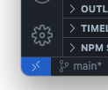
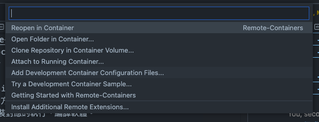
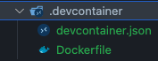
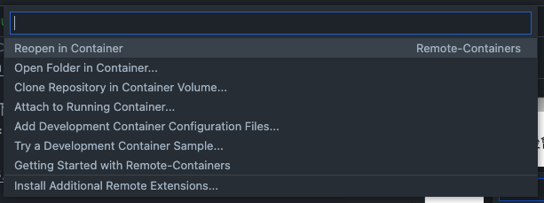
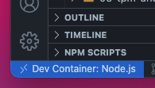
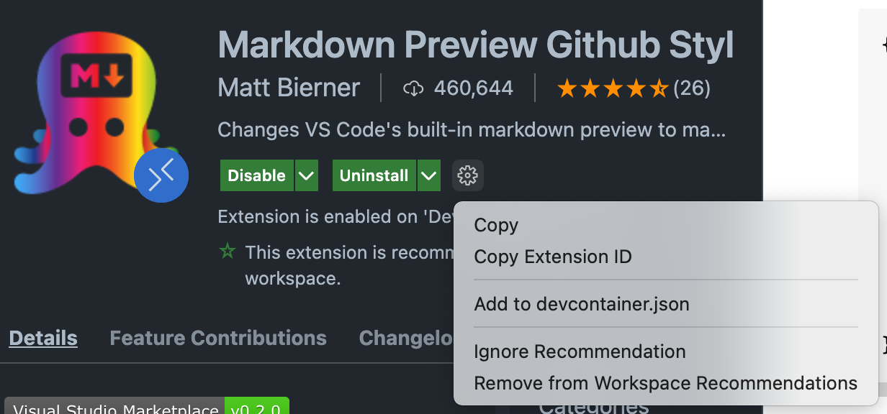

# 19 - Remote - Containers - 在容器中開發

在正式開發前，開發者都需要安裝許多軟體，來建立開發的環境。但是安裝的方式會因開發所在的機器環境而有所不同，因此每次的配置都是一個麻煩，並且在配置時是不會有產出的。

而依照開發對象的不同，所要安裝的工具也會有所差異，這會導致開發者需要在電腦中安裝各式各樣的軟體，就算只是想要修改一個小部分也是一樣，十分的麻煩。

隨著容器化技術的進步，我們現在已經可以把編譯與執行的工作交給容器了，而開發的環境（例如：編譯器的支援、開發工具等）是否也可以容器化呢？

## 給你的開發一對翅膀 - Remote - Containers

[Remote - Containers](https://marketplace.visualstudio.com/items?itemName=ms-vscode-remote.remote-containers) 是個 Visual Studio Code 插件，藉由 Docker 的幫助，這個插件可以讓整個在 VS Code 內的開發環境都執行在容器中，包括 VS Code 內的編輯、終端、除錯與執行等。

只要使用了 Remote - Containers ，我們就可以在一個只安裝 Docker 與 VS Code 的環境下，使用最舒適的方式進行各種開發作業，像是 Node.js 、 Python 、 Java 等，而不需要再去安裝對應的執行、編譯軟體。

## 安裝 Remote - Containers

由於 Remote - Containers 內部使用 Docker 進行容器化的相關程序，因此需要先安裝 [Docker Desktop](https://www.docker.com/products/docker-desktop) 。

在安裝完 Docker 後，使用 `code` 指令安裝 Remote - Container ：

```bash
code --install-extension ms-vscode-remote.remote-containers
```

這樣就可以開始使用 Remote - Containers 開發了。

## 使用 Remote - Containers

安裝完成後，可以看到 VS Code 的左下角多了一個按鈕。



按下去後會開啟一個指令列，按下 **Add Development Container Configuration Files...** 。



進去後它會列出不同環境的預配置，選擇你開發所需的環境（如果沒有找到可以選擇 **Show All Definitions** ，它會提供更多的選擇），按下去後依照程序做相關的設定，結束後會建立一個 `.devcontainer` 的目錄。



```plaintext
root /
|- .devcontainer /
  |- devcontainer.json
  |- Dockerfile
```

這個目錄會有兩個檔案 `devcontainer.json` 與 `Dockerfile` 。

- `devcontainer.json` ： Remote - Container 的配置檔。
- `Dockerfile` ：依據所選環境產生的 Docker Image 設定。

這樣我們的配置就完成了。

接著再按一次左下角的 Remote - Container 圖示，並且執行 **Reopen in Container** 。



它會將整個 Visual Studio Code 重啟，並執行在容器中，當開啟完成後，在左下角可以看到所開啟的容器名稱。



如此一來，我們就可以使用容器做開發了。

## 在容器中預設插件

Remote - Container 預設容器內要安裝的插件，可以在 `devcontainer.json` 中的 `extensions` 屬性中加入想要預設的插件。

```json
{
  // ...
  // Add the IDs of extensions you want installed when the container is created.
  "extensions": [
    "yzhang.markdown-all-in-one",
    "davidanson.vscode-markdownlint",
    "esbenp.prettier-vscode",
    "streetsidesoftware.code-spell-checker",
    "editorconfig.editorconfig",
    "bierner.markdown-preview-github-styles"
  ]
}
```

也可以在插件頁中按下齒輪選擇 **Add to devcontainer.json** 。



按下按鈕後， VS Code 會幫你將此插件的 ID 加入 `devcontainer.json` 中。

## 容器中的預設配置

在 `devcontainer.json` 中設定 `settings` 屬性可以配置 VS Code 的預設值。

```json
{
  // ...
  // Set *default* container specific settings.json values on container create.
  "settings": {
    "editor.formatOnSave": true,
    "editor.defaultFormatter": "esbenp.prettier-vscode",
    "editor.codeActionsOnSave": {
      "source.fixAll.markdownlint": true
    },
    "[ignore]": {
      "editor.defaultFormatter": "foxundermoon.shell-format"
    }
  }
}
```

## 本文重點整理

- 在傳統的開發中，需要安裝多種軟體、執行環境與工具才能開始進入開發的工作。
- 藉由 Remote - Container 的幫助，可以將 VS Code 中的開發環境搬至容器中，藉由容器的幫助，不需要再安裝許多的軟體，可以立即開始開發。
- 依照 Remote - Container 的步驟，可以產生一個名為 `.devcontainer` 的目錄，裡面會有：
  - `Dockerfile` ：依照配置步驟所建立的 Docker image 設定檔。
  - `devcontainer.json` ： VS Code 容器的相關配置。
- 在 `devcontainer.json` 中可以使用 `extensions` 屬性設定需要預安裝的插件。
- 在 `devcontainer.json` 中可以使用 `settings` 屬性設定需要的預配置。

## 參考資料

- [Visual Studio Code ： Developing inside a Container](https://code.visualstudio.com/docs/remote/containers)
- [Visual Studio Code Marketplace ： Remote - Containers](https://marketplace.visualstudio.com/items?itemName=ms-vscode-remote.remote-containers)
