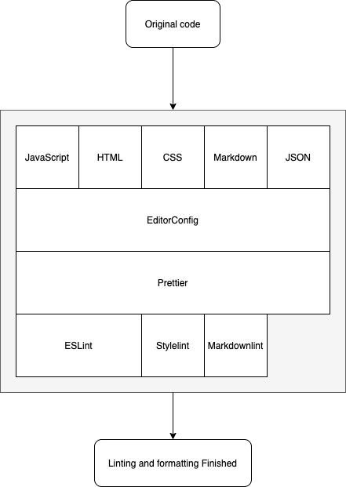

# 27 - EditorConfig + Prettier + ESLint + Stylelint + Markdownlint - All you can lint

將各式 linter 與 formatter 工具整合於同個專案中，讓開發者可以：

- 使用 EditorConfig 配置的設定做輸入。
- 使用 Prettier 作為所有語言的 formatter 。
- 使用 ESLint 作為 JavaScript 的 linter 。
- 使用 Stylelint 作為 Style 的 linter 。
- 使用 Markdownlint 作為 Markdown 的 linter 。

## 配置理念



EditorConfig 、 Prettier 、 ESLint 、 Stylelint 與 Markdownlint 之間，由於功能相近，因此會有些許的功能重疊：

- EditorConfig 與 Prettier （例如： EditorConfig 的 [`end_of_line`](https://github.com/editorconfig/editorconfig/wiki/EditorConfig-Properties#end_of_line) 屬性與 Prettier 的 [`endOfLine`](https://prettier.io/docs/en/options.html#end-of-line) 選項）。
- ESLint 與 Prettier （例如： ESLint 的 [`linebreak-style`](https://eslint.org/docs/rules/linebreak-style) 規則與 Prettier 的 `endOfLine` 選項）。
- Stylelint 與 Prettier （例如： Stylelint 的 [`linebreaks`](https://stylelint.io/user-guide/rules/list/linebreaks) 規則與 Prettier 的 `endOfLine` 選項）。
- Markdownlint 與 Prettier （例如： Markdownlint 的 [`no-multiple-blanks`](https://github.com/DavidAnson/markdownlint/blob/main/doc/Rules.md#md012---multiple-consecutive-blank-lines) 規則與 Prettier 的 [Empty lines 原則](https://prettier.io/docs/en/rationale.html#empty-lines)）。

為了避免個工具間產生衝突，理想的配置應該讓各工具專職於它們主要的工作，把那些重疊的工作分配至合適的工具上，並將其他工具中有重疊到的部分給關閉。

為此，我們需要作下列的處理：

- Prettier **依照** EditorConfig 的配置設定格式。
- ESLint 、 Stylelint 與 Markdownlint **關閉** format 相關的規則。

## 前置條件

在整合前，我們需要先安裝 EditorConfig 、 Prettier 、 ESLint 、 Stylelint 與 Markdownlint 並加入它們的配置，詳細資訊可以參考「 [16 - EditorConfig - 配置輸入方式](../16-editor-config/README.md)」、「 [23 - Prettier - 格式化程式碼工具](../23-prettier/README.md)」、「 [24 - ESLint - Lint JavaScript 程式碼](../24-eslint/README.md)」、「 [25 - Stylelint - Lint CSS 程式碼](../25-stylelint/README.md)」與「 [26 - MarkdownLint - Lint Markdown 文件](../26-markdownlint/README.md)」。

之前的章節介紹各個工具的配置方式都是獨立的，還未做整合，接下來就讓我們來看看如何整合這些工具吧。

## 整合 EditorConfig 與 Prettier

Prettier 預設會偵測專案中是否有 EditorConfig 的配置檔 `.editorconfig` ，如果有的話， Prettier 會將 EditorConfig 的設定轉為自己的配置做使用。

Prettier 可以轉換的 EditorConfig 屬性如下：

| EditorConfig              | Prettier     |
| ------------------------- | ------------ |
| `end_of_line`             | `endOfLine`  |
| `indent_style`            | `useTabs`    |
| `indent_size`/`tab_width` | `tabWidth`   |
| `max_line_length`         | `printWidth` |

> Prettier 使用 [`editorconfig-to-prettier`](https://github.com/josephfrazier/editorconfig-to-prettier) 轉換 EditorConfig 屬性。

如果在 Prettier 的配置檔（例如： `.prettierrc.js` ）中設定上列的屬性，則會忽略 EditorConfig 的設定，改以 Prettier 配置檔為準。

如果 EditorConfig 與 Prettier 對相同的屬性設定不同的值時，就會造成輸入與格式化間的格式不一致，導致衝突的發生。

為了避免這問題發生，我們可以將 EditorConfig 能夠配置的屬性都交由 EditorConfig 設定，避免在 Prettier 中設定這些屬性：

```js
module.exports = {
  singleQuote: true,
  htmlWhitespaceSensitivity: 'strict',
  // The options below config in EditorConfig, do not config here
  // endOfLine: 'lf', // `end_of_line`
  // useTabs: false, // `indent_style`
  // tabWidth: 2, // `indent_size` / `tab_width`
  // printWidth: 80, // `max_line_length`
};
```

這些屬性可以在 EditorConfig 的配置檔中做設定：

```ini
root = true

[*]
indent_style = space
indent_size = 2
end_of_line = lf
max_line_length = 80
# ...
```

這樣一來格式化時， Prettier 就會依照 EditorConfig 的配置做處理，避免衝突的產生。

> 如果不想要 Prettier 參考 EditorConfig 的配置，可以在指令中加上 [`--no-editorconfig`](https://prettier.io/docs/en/cli.html#--no-editorconfig) 參數。

## 整合 Prettier 、 ESLint 、 Stylelint 與 Markdownlint

各式的 Linters 對於其專注的語言（ JavaScript 、 Stylelint 與 Markdownlint ）都擁有 format 的能力，我們可以單純使用它們做 format ，而不需要 Prettier ，但這樣做會有缺點：

- 格式化的對象僅限於特定語言：與 Prettier 可以[支援多語言](https://prettier.io/docs/en/index.html)不同， Linters 的格式化都僅限於特定的語言（ JavaScript 、 CSS 或 Markdown 等）。為了格式化其他格式的檔案，你需要另外引入其他的格式化工具。
- 同時維護多個格式化配置： 各 Linters 間的配置不共通，為了格式化的一致性，你需要自己確保各個配置擁有相同的格式化規則。
- Linters 的提示依照配置會以紅（黃）色毛毛蟲線顯示於編輯器上，如果加上格式化的提示，會破壞畫面的整潔，難以保持專注。

由於上述的原因，將 Prettier 作為專案中**唯一**的格式化工具是個最佳選擇。

要將 Prettier 作為格式化工具，就需要將 Linters **格式化相關的規則關閉**。

### 使用 `eslint-config-prettier` 關閉 ESLint 的格式化規則

[`eslint-config-prettier`](https://github.com/prettier/eslint-config-prettier) 為 ESLint 的規則包，它會將所有與 Prettier 規則有重疊到的規則關閉。

首先安裝 `eslint-config-prettier` ：

```bash
npm install eslint-config-prettier --save-dev
```

將 `prettier` 設置於 `extends` 陣列的**最後一個元素**（設置於最後是為了避免被其他的規則覆寫）：

```js
module.exports = {
  extends: ['airbnb-base', 'prettier'],
};
```

這樣 ESLint 就不會處理任何與 Prettier 有關的規則了。

### 使用 `stylelint-config-prettier` 關閉 Stylelint 的格式化規則

[`stylelint-config-prettier`](https://github.com/prettier/stylelint-config-prettier) 為 Stylelint 的規則包，它會將所有與 Prettier 規則有重疊到的規則關閉。

首先安裝 `stylelint-config-prettier` ：

```bash
npm install stylelint-config-prettier --save-dev
```

將 `stylelint-config-prettier` 設置於 `extends` 陣列的**最後一個元素**（設置於最後是為了避免被其他的規則覆寫）：

```js
module.exports = {
  extends: ['stylelint-config-standard', 'stylelint-config-prettier'],
};
```

這樣 Stylelint 就不會處理任何與 Prettier 有關的規則了。

### 關閉 Markdownlint 中的格式化規則

Markdownlint 中有幾個規則包含於 Prettier 的範圍內，我們需要將這些規則關閉：

```js
module.exports = {
  // ...
  // Prettier overrides
  'line-length': false, // `printWidth`
  'no-multiple-blanks': false, // Rationale: Empty lines
  'list-marker-space': false, // Rationale
};
```

這樣一來， Markdownlint 就不會處理 Prettier 相關的規則了。

## 本文重點整理

- 在整合輸入、格式化與 lint 工具時，秉持著一事不二做的精神，將各工具專注於它們擅長的領域上，避免工具間發生衝突。
- 整合完成後，我們可以將專案中的各種檔案格式的程式碼品質都兼顧到，來避免錯誤的產生。

## 參考資料

- [Prettier: API](https://prettier.io/docs/en/api.html#prettierresolveconfigfilepath--options)
- [Prettier: Options](https://prettier.io/docs/en/options.html)
- [EditorConfig Properties](https://github.com/editorconfig/editorconfig/wiki/EditorConfig-Properties)
- [Prettier: Integrating with Linters](https://prettier.io/docs/en/integrating-with-linters.html)
- [markdownlint Rules](https://github.com/DavidAnson/markdownlint/blob/main/doc/Rules.md)
